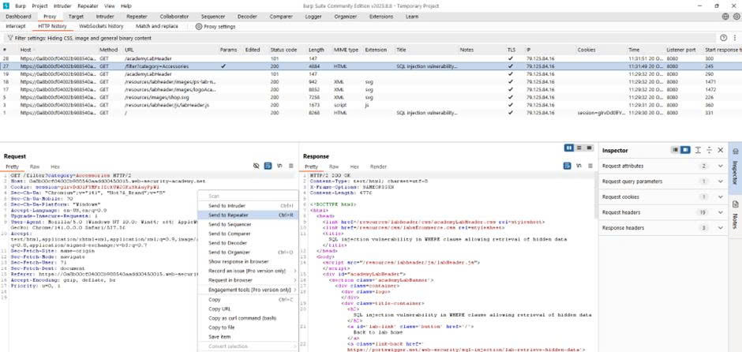
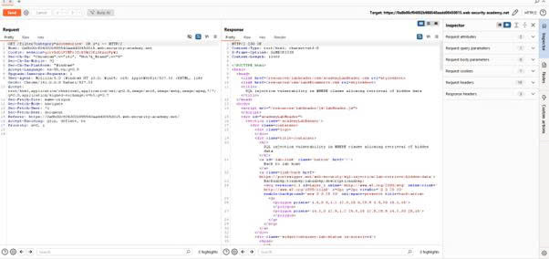
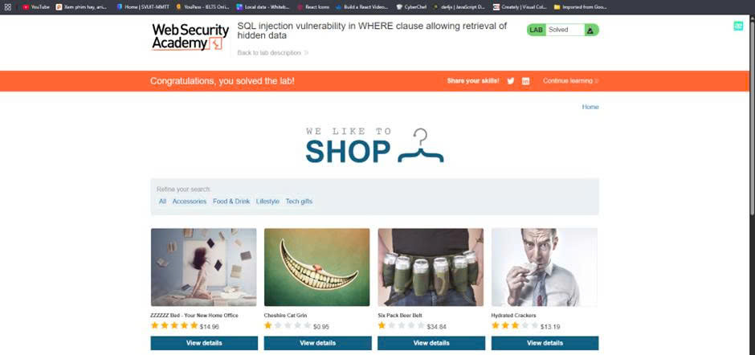

# 🔓 Lab 1: SQL injection vulnerability in WHERE clause allowing retrieval of hidden data

---

## Mô tả

Sử dụng Burp Suite để chặn và sửa đổi request thiết lập bộ lọc danh mục sản phẩm. Sửa đổi tham số category với giá trị `'+OR+1=1--` để hiển thị các sản phẩm chưa được phát hành.

## Các bước thực hiện

### Bước 1: Sử dụng Burp Suite để chặn request

1. Mở Burp Suite
2. Truy cập lab và chọn một danh mục sản phẩm bất kỳ

### Bước 2: Sửa đổi tham số category

1. chọn gói tin GET 1 trường category bất kì và đưa vào ***Repeater***, tìm tham số `category`
2. Thêm payload: `'+OR+1=1--`

### Bước 3: Submit request và xác minh kết quả

1. Click **Send** để gửi request đã sửa đổi
2. Xác minh rằng response hiển thị các sản phẩm chưa được phát hành

