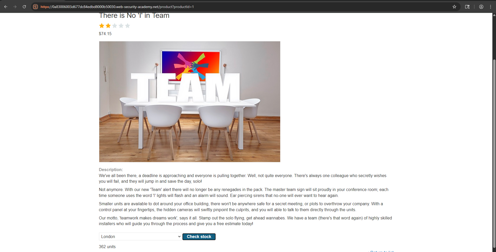
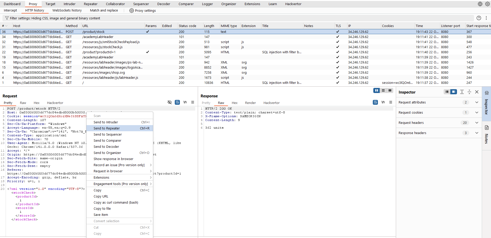
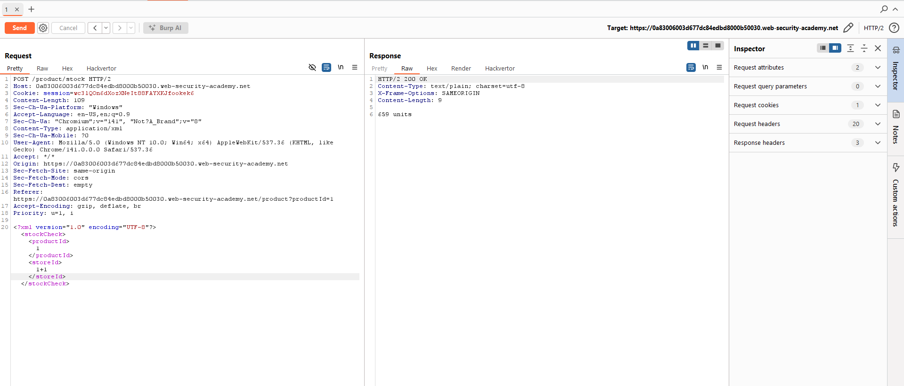
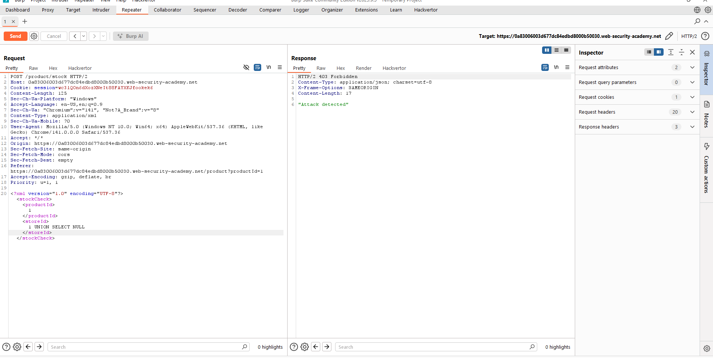
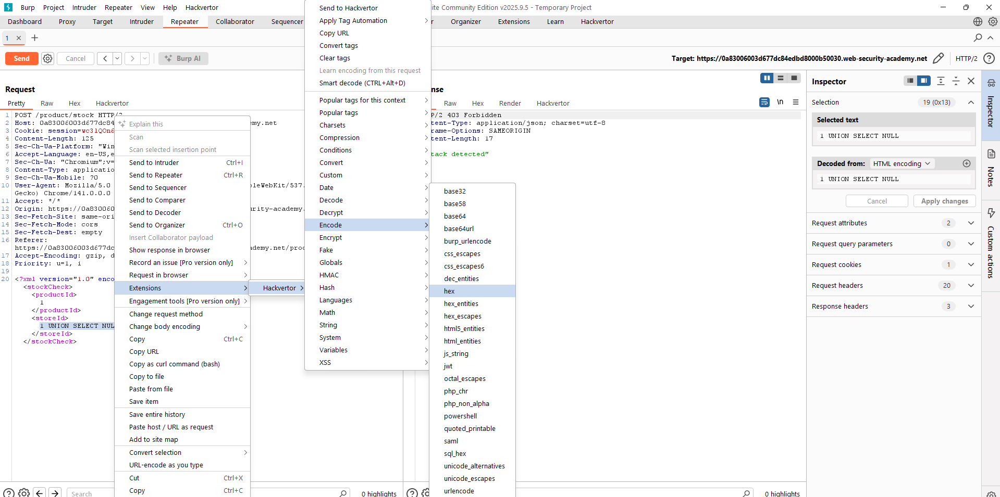
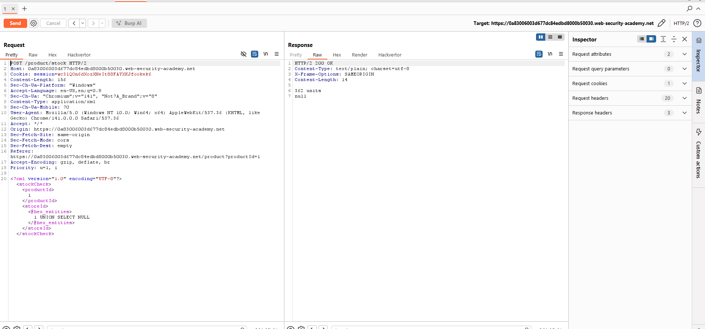
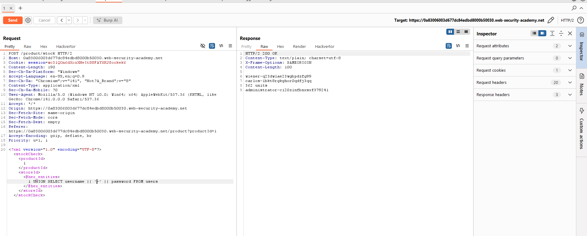
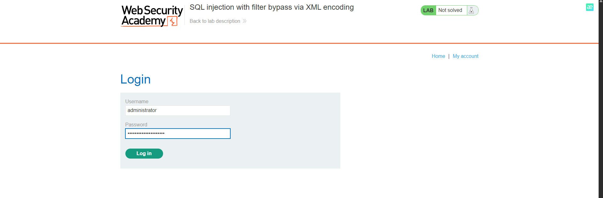

# 🔐 Lab 18: SQL injection with filter bypass via XML encoding

<div align="center">


</div>

## Mô tả

Lab này chứa một lỗ hổng SQL Injection trong tính năng kiểm tra tồn kho (stock check). Ứng dụng gửi `productId` và `storeId` dưới dạng XML và kết quả truy vấn được trả về trong phản hồi của ứng dụng, cho phép thực hiện tấn công UNION để truy xuất dữ liệu từ các bảng khác.

Mục tiêu: khai thác lỗ hổng để thu thập thông tin tài khoản của người dùng `admin`, sau đó đăng nhập bằng thông tin lấy được để giải quyết lab.

## Các bước thực hiện
### 1. Xác định lỗ hổng

Gửi yêu cầu POST `/product/stock` với một `productId` và `storeId` hợp lệ và quan sát phản hồi.


Thay đổi `storeId` thành một biểu thức toán học để kiểm tra xem input có bị xử lý/evaluated không, ví dụ:

```xml
<storeId>1+1</storeId>
```

Ứng dụng trả về tồn kho cho `storeId=2`, điều đó cho thấy giá trị đã được đánh giá bên phía server và khả năng bị SQL injection tồn tại.

### 2. Thử UNION SELECT để hiểu cấu trúc truy vấn

Thử thêm `UNION SELECT NULL` vào `storeId` để xác định số lượng cột và kiểu dữ liệu được trả về. Vì đây là XML payload, ban đầu request này sẽ bị WAF chặn.

### 3. Bypass WAF bằng mã hóa thực thể XML

Vì đang tiêm vào trong XML, mã hóa phần payload SQL bằng thực thể XML (XML entities). Ví dụ dùng Hackvertor để chuyển `1 UNION SELECT NULL` thành dạng hex_entities.


Sau khi mã hóa, gửi lại request — WAF không phát hiện, ứng dụng sẽ trả về phản hồi bình thường và có thể tiếp tục thăm dò.

### 4. Xác định số cột / một cột trả về

Quan sát rằng truy vấn gốc dường như trả về một cột. Nếu cố gắng trả về nhiều cột sẽ gây lỗi hoặc trả về 0 đơn vị.

Vì chỉ có thể trả về một cột, cần concatenate các trường username và password thành một giá trị chuỗi duy nhất.

### 5. Lấy thông tin người dùng bằng UNION SELECT

Sử dụng phép ghép chuỗi phù hợp với hệ quản trị cơ sở dữ liệu mục tiêu. Trong nhiều DBMS (SQLite, PostgreSQL) toán tử ghép chuỗi là `||`. Với MySQL có thể dùng `CONCAT(username, '~', password)`.


```xml
<storeId><@hex_entities>1 UNION SELECT username || '~' || password FROM users</@hex_entities></storeId>
```


Gửi request và đọc phản hồi — sẽ nhận được danh sách `username~password` từ bảng `users`.

### 6. Đăng nhập bằng tài khoản administrator

 Lấy dòng chứa `admin~<mật_khẩu>` từ phản hồi.
 Đăng nhập vào giao diện ứng dụng với thông tin này 

