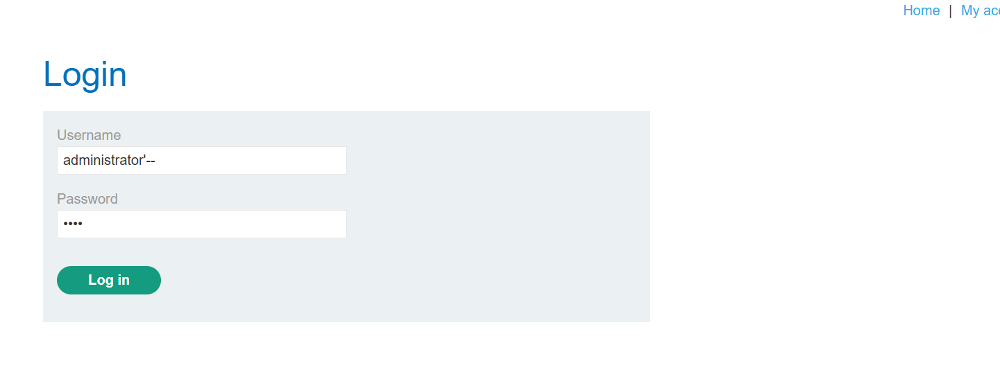
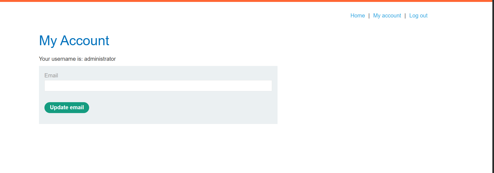

### Bước 1: Ta thử đăng nhập username với dấu ‘ ta được kết quả lỗi.Vì thông báo lỗi ta có thể suy ra được rằng nó đang bị 1 lỗi gì đó ở trong câu truy vấn sql ví dụ selec… from… username = ‘’’ pasword = ‘abc’.

### Bước 2. Ta thử khai thác bằng việc nhập username = 'administrator'--.Kết quả khai thác thành công

