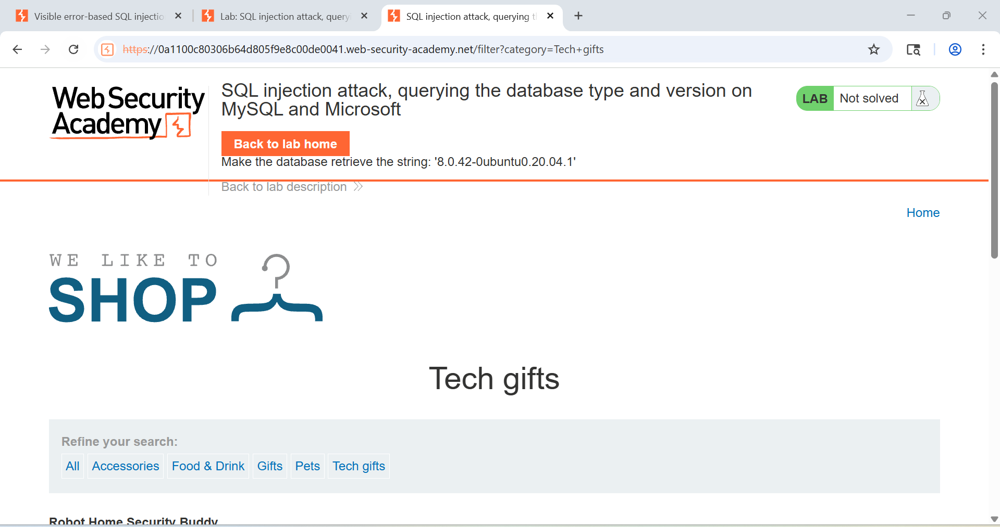
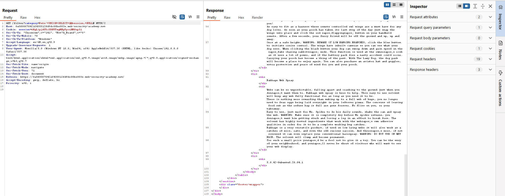

## 📋 Câu 4: SQL Injection - Liệt kê thông tin cơ sở dữ liệu

### 🎯 Mục tiêu
Khai thác lỗ hổng SQL injection để liệt kê nội dung cơ sở dữ liệu và lấy thông tin phiên bản database.

### 🔍 Quá trình thực hiện

#### 🔸 Bước 1: Kiểm tra giao diện và xác định lỗ hổng
- ✅ Truy cập vào trang web và kiểm tra các điểm có thể bị tấn công SQL injection
- ✅ Xác định các form input hoặc parameter có thể bị khai thác
<div align="center">
  
  <br>
  <em>Hình 1: Giao diện trang web và các điểm có thể bị tấn công SQL injection</em>
</div>

#### 🔸 Bước 2: Xác định số cột trong truy vấn
> **💡 Payload sử dụng:**
```sql
'+UNION+SELECT+'abc','def'--
```

> **📊 Kết quả:**
- ✅ Xuất hiện 2 dòng với nội dung "abc" và "def"
- ✅ Chứng minh truy vấn gốc có đúng 2 cột
- ✅ Xác nhận có thể sử dụng UNION SELECT để khai thác
<div align="center">
  
  <br>
  <em>Hình 2: Minh họa kết quả</em>
</div>

#### 🔸 Bước 3: Lấy thông tin phiên bản database
> **💡 Payload sử dụng:**
```sql
'+UNION+SELECT+@@version,+NULL#
```

> **📊 Kết quả:**
- ✅ Hiển thị phiên bản của cơ sở dữ liệu
- ✅ Xác nhận thành công việc khai thác SQL injection
<div align="center">
  
  <br>
  <em>Hình 3: Minh họa kết quả</em>
</div>

### 🎯 Kết luận
> ⚠️ **Cảnh báo:** Đã thành công khai thác lỗ hổng SQL injection để lấy thông tin phiên bản cơ sở dữ liệu, chứng minh hệ thống có lỗ hổng bảo mật nghiêm trọng.

---
