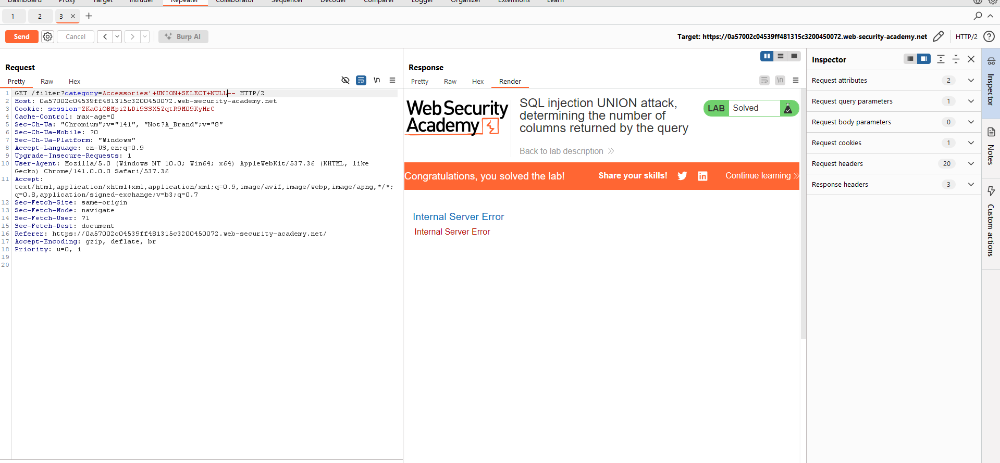
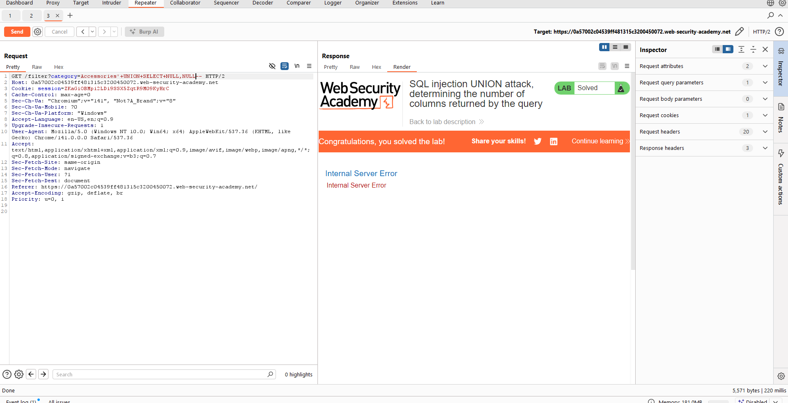
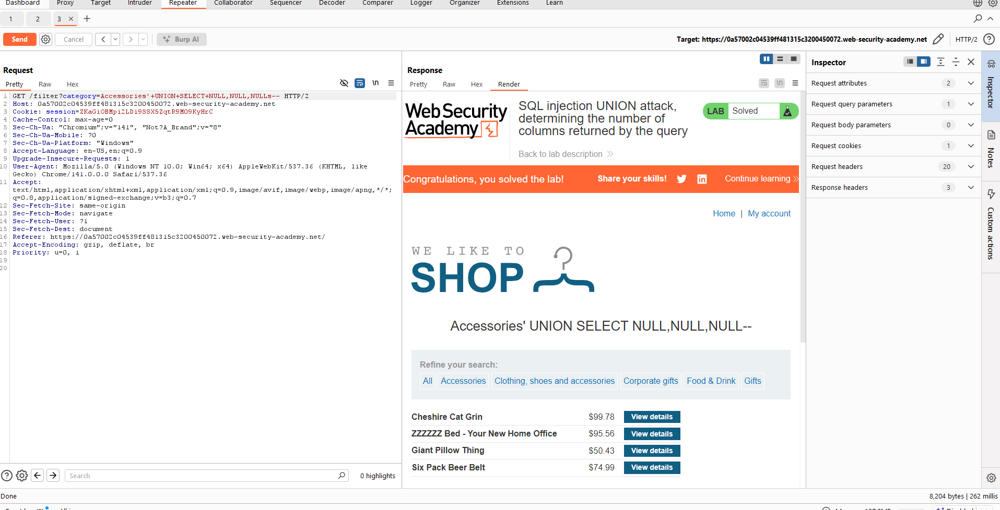

# 🔐 Lab 7: SQL injection UNION attack, determining the number of columns returned by the query

<div align="center">


</div>

---

## Mô tả

Lab này chứa lỗ hổng SQL injection trong bộ lọc danh mục sản phẩm. Kết quả từ truy vấn được trả về trong response của ứng dụng, do đó chúng ta có thể sử dụng UNION attack để truy xuất dữ liệu từ các bảng khác.

**Mục tiêu:** Xác định số lượng cột được trả về bởi truy vấn thông qua SQL injection UNION attack trả về một hàng bổ sung chứa các giá trị null.


## Các bước thực hiện
### Bước 1: Truy cập vào lab 

Trong Chrominum, click vào một danh mục sản phẩm bất kỳ (ví dụ: "Accessories") trên trang web.


Burp Suite sẽ bắt được request GET với tham số `category`.

Click chuột phải vào request và chọn "Send to Repeater" hoặc nhấn `Ctrl+R` để gửi request sang tab Repeater để tiện test.


### Bước 2: Thử nghiệm với 1 cột NULL

Trong Repeater, chèn thêm payload vào `category`:
```
'+UNION+SELECT+NULL--
```



Quan sát response, bạn sẽ thấy xuất hiện lỗi. Điều này cho thấy số cột chưa đúng.

### Bước 3: Thử nghiệm với 2 cột NULL

Sửa payload thành:
```
'+UNION+SELECT+NULL,NULL--
```


Kiểm tra response. Vẫn còn lỗi, tiếp tục thêm NULL.

### Bước 4: Thử nghiệm với 3 cột NULL

Sửa payload thành:
```
'+UNION+SELECT+NULL,NULL,NULL--
```



Gửi request và quan sát response.

Response không còn lỗi và hiển thị thêm nội dung chứa các giá trị null, điều này có nghĩa là truy vấn ban đầu trả về **3 cột**.

