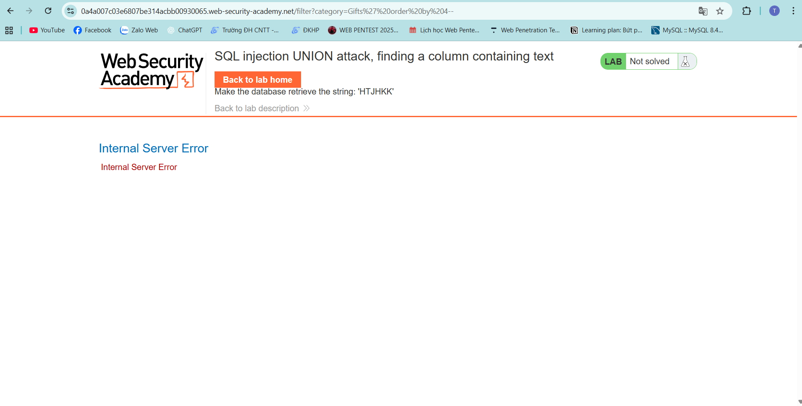
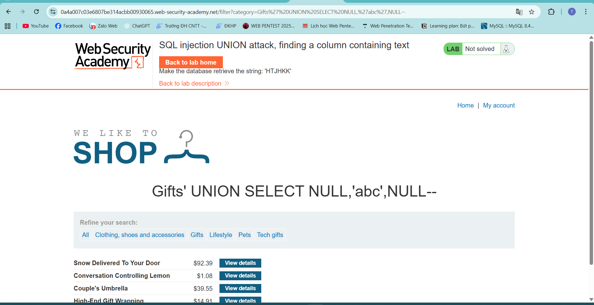
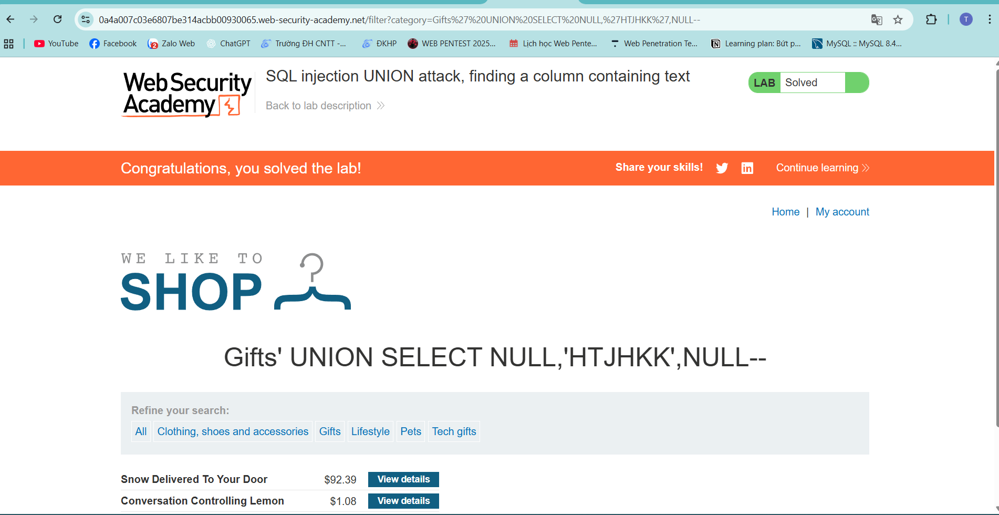

# Lab 8 — Xác định cột chứa dữ liệu chuỗi

1. **Xác định số lượng cột của bảng**

   * Thực nghiệm và quan sát cho thấy **bảng có 3 cột**.

2. **Xác định cột kiểu `string`**

   * Vì đề bài yêu cầu tìm chuỗi `HTTJHK` (kiểu dữ liệu string), ta cần biết cột nào trong 3 cột là cột text.
   * Cách làm: thử chèn một giá trị string lần lượt vào từng cột và quan sát phản hồi của trang web.

3. **Kết quả thử nghiệm**

   * Khi chèn string vào **cột thứ 2**, trang web **không bị lỗi** và chấp nhận input.
   * Kết luận: **cột thứ 2 là cột kiểu string** → ta đưa chuỗi cần tìm (`HTTJHK`) vào cột này.

4. **Kết luận chung**

   * Đã xác định được cột chứa chuỗi và áp dụng payload vào cột thứ 2.
   * **Khai thác thành công.**

---

> Ghi chú: chỉ thực hiện các bước này trên môi trường được phép (authorized testing).
